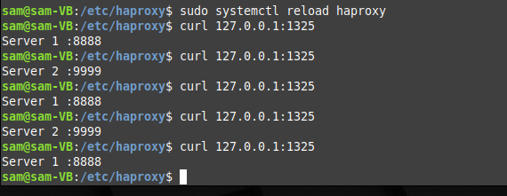
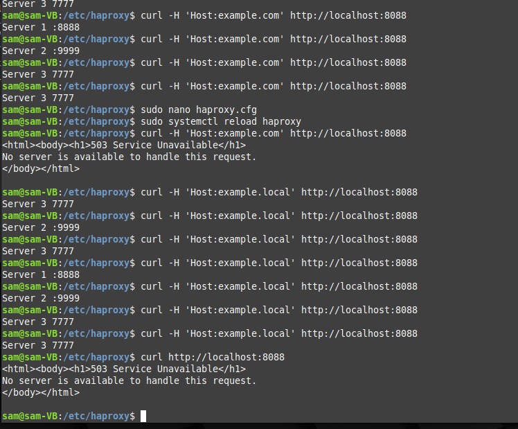

# Домашнее задание к занятию 2 «Кластеризация и балансировка нагрузки» - Липовецкий Александр

Файл конфигурации HaProxy с настройкой балансировки Round-robin на 4 уровне.  
[Файл конфигурации HaProxy](./haproxy.cfg)  

Скриншот работы балансировки HaProxy на 4 уровне.  
  

Файл конфигурации HaProxy с настройкой балансировки Weighted Round Robin на 7 уровне, чтобы первый сервер имел вес 2, второй - 3, а третий - 4, только тот http-трафик, который адресован домену example.local.  
[Файл конфигурации HaProxy](./local_haproxy.cfg)  

Скриншот работы балансировки HaProxy с Weighted Round Robin на 7 уровне, к домену example.local.  
  
  
