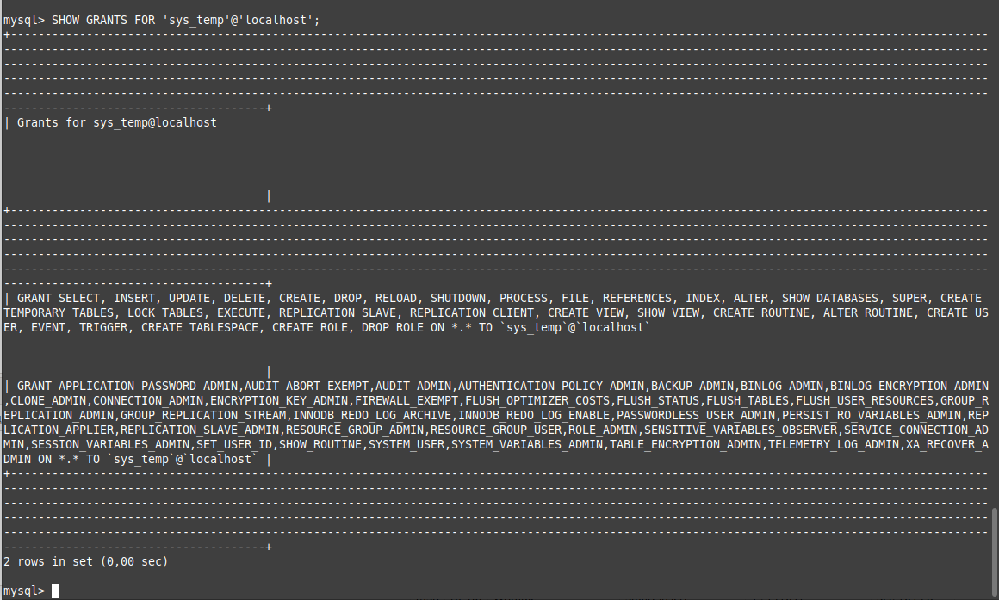
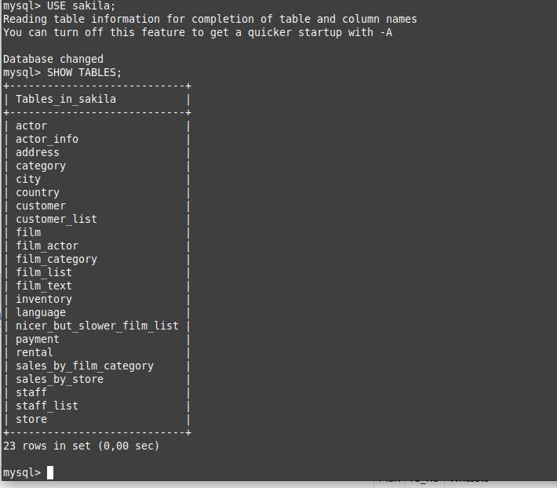

# Домашнее задание к занятию «Работа с данными (DDL/DML)» - Липовецкий Александр  
  
Задание можно выполнить как в любом IDE, так и в командной строке.  

## Задание 1   

1.1. Поднимите чистый инстанс MySQL версии 8.0+. Можно использовать локальный сервер или контейнер Docker.

1.2. Создайте учётную запись sys_temp.

1.3. Выполните запрос на получение списка пользователей в базе данных. (скриншот)

1.4. Дайте все права для пользователя sys_temp.

1.5. Выполните запрос на получение списка прав для пользователя sys_temp. (скриншот)

1.6. Переподключитесь к базе данных от имени sys_temp.

Для смены типа аутентификации с sha2 используйте запрос:

ALTER USER 'sys_test'@'localhost' IDENTIFIED WITH mysql_native_password BY 'password';
1.6. По ссылке https://downloads.mysql.com/docs/sakila-db.zip скачайте дамп базы данных.

1.7. Восстановите дамп в базу данных.

1.8. При работе в IDE сформируйте ER-диаграмму получившейся базы данных. При работе в командной строке используйте команду для получения всех таблиц базы данных. (скриншот)

Результатом работы должны быть скриншоты обозначенных заданий, а также простыня со всеми запросами.

### Ответ на задание 1.  

Команды:  
sudo apt update  
sudo apt upgrade  
sudo apt install mysql-server  
sudo systemctl status mysql  
mysql --version  
sudo mysql_secure_installation  
sudo mysql  
mysql -u root -p  
ALTER USER 'root'@'localhost' IDENTIFIED WITH caching_sha2_password BY 'my_password';  
FLUSH PRIVILEGES;  
SELECT user,authentication_string,plugin,host FROM mysql.user;  
exit  
mysql -u root -p  
CREATE USER 'sys_temp'@'localhost' IDENTIFIED BY 'password';   
SELECT user,authentication_string,plugin,host FROM mysql.user;  
GRANT ALL PRIVILEGES ON *.* TO 'sys_temp@'localhost';  
FLUSH PRIVILEGES;  
SHOW GRANTS FOR 'sys_temp'@'localhost';  
exit  
mysql -u sys_temp -p  
ALTER USER 'sys_temp'@'localhost' IDENTIFIED WITH mysql_native_password BY 'password';  
CREATE DATABASE sakila;  
exit  
cd ./sakila-db/sakila-db  
mysql -u sys_temp -p sakila < sakila-schema.sql  
mysql -u sys_temp -p sakila < sakila-data.sql   
mysql -u root -p  
USE sakila;  
SHOW TABLES;  
SELECT TABLE_NAME, COLUMN_NAME FROM information_schema.KEY_COLUMN_USAGE WHERE TABLE_SCHEMA = 'sakila' AND CONSTRAINT_NAME = 'PRIMARY';  
exit  

Скриншот списка пользователей в базе данных.  
  

Скриншот списка прав для пользователя sys_temp.  
  

Скриншот списка таблиц восстановленной БД sakila.  
  

Скриншот ER-диаграммы.  
  
  
  
## Задание 2   

Составьте таблицу, используя любой текстовый редактор или Excel, в которой должно быть два столбца: в первом должны быть названия таблиц восстановленной базы, во втором названия первичных ключей этих таблиц. Пример: (скриншот/текст)  

Название таблицы | Название первичного ключа  
customer         | customer_id  

### Ответ на задание 2.  

Файл с таблицами и первичными ключами этих таблиц.   
[Файл с таблицами и первичными ключами](./colums_key.txt)  