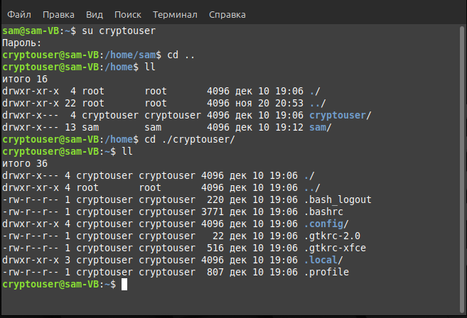

# Домашнее задание к занятию «Защита хоста» - Липовецкий Александр

## Задание 1  

Установите eCryptfs.  
Добавьте пользователя cryptouser.  
Зашифруйте домашний каталог пользователя с помощью eCryptfs.  

В качестве ответа пришлите снимки экрана домашнего каталога пользователя с исходными и зашифрованными данными.  

### Ответ на зажание 1

Скриншот домашней папки пользователя "cryptouser" до шифрования.  

Скриншот домашней папки пользователя "cryptouser" после шифрования.  

## Задание 2  

Установите поддержку LUKS.  
Создайте небольшой раздел, например, 100 Мб.  
Зашифруйте созданный раздел с помощью LUKS.  

В качестве ответа пришлите снимки экрана с поэтапным выполнением задания.  

### Ответ на задание 2  

Создание раздела sdb1 на устройстве sdb (раздел на 90М, так как устройство изначально сделал на 100M, решил сделать чуть меньше, как бы часть диска)  

  

Шифрование созданного раздела sdb1 с помощью LUKS, открытие зашифрованного раздела, создание файловой системы /dev/mapper/disk, создание точки монтирования и монтирование раздела.  

  