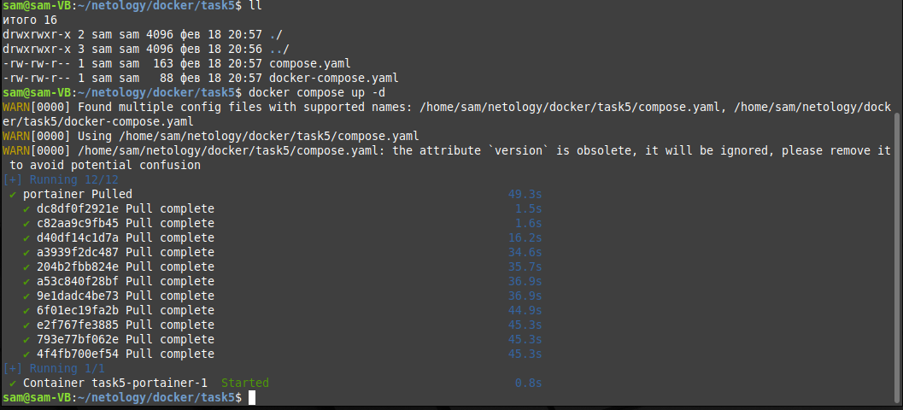
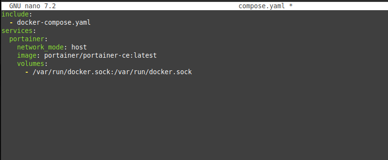
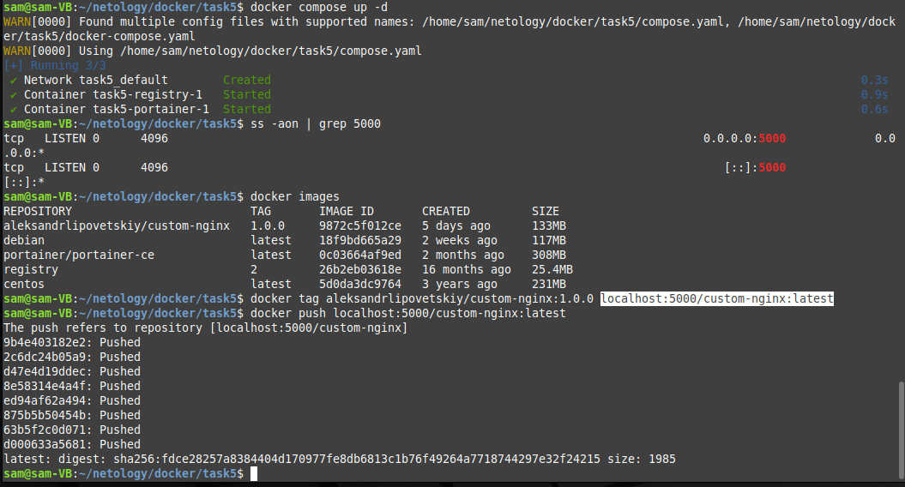
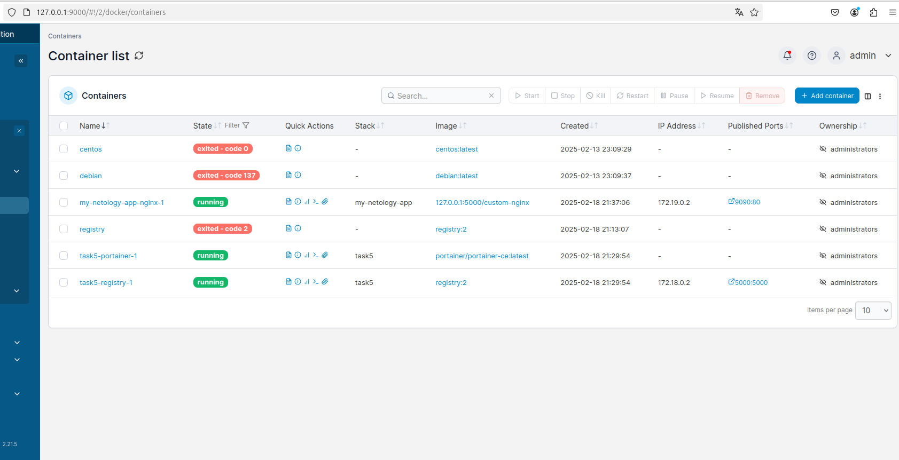
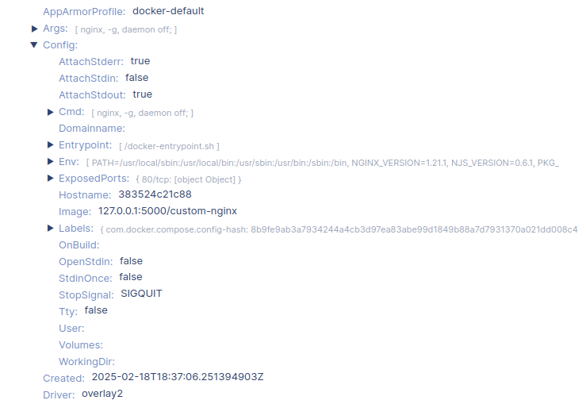
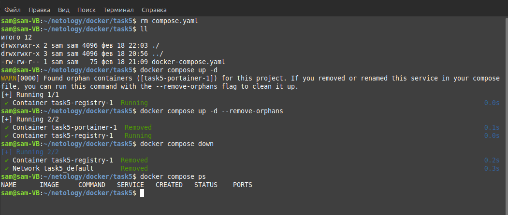

# Домашнее задание к занятию «Оркестрация группой Docker контейнеров на примере Docker Compose» - Липовецкий Александр  

## Ответ на задание 1  

[Ссылка на докер образ "custom-nginx"](https://hub.docker.com/repository/docker/aleksandrlipovetskiy/custom-nginx/general)  

## Ответ на задание 2  

```bash
docker run -d --name "aleksandrlipovetskiy-custom-nginx-t2" -p 127.0.0.1:8080:80 aleksandrlipovetskiy/custom-nginx:1.0.0
```   

```bash
docker rename "aleksandrlipovetskiy-custom-nginx-t2" custom-nginx-t2
```   

Выполненные команды:  
   

Скриншот работы nginx в обозревателе:  
  

## Ответ на задание 3  

Немного поехал скрин, первую команду укажу ниже, заметил только уже когда запушил на git.

```bash
docker attach custom-nginx-t2
```  

Выполненные команды:  
   

Выполненные команды:  
 

После выполнения команды docker attach, все, что вы вводите в терминале, будет передано в стандартный поток ввода контейнера. Следовательно, при вводе команды Ctrl-C в поток ввода docker контейнера будет передана команда остановки "signal 2 (SIGINT)".

После изменения "/etc/nginx/conf.d/default.conf", серевер внутри контейнера не настроен на прослушивание порта 80, а сетевая связь настроена между портами 8080 хоста и портом 80 контейнера. То есть получается сетевая связь есть, но нет ответа сервера nginx, а на 81 порт сетевой связи нет.  

## Ответ на задание 4  

Выполненные команды:  
  

## Ответ на задание 5  

Создал каталог task5 и два файла compose.yaml и docker-compose.yaml в нем, после чего выполнил команду  
```bash
docker compose up -d
```
  
  

Видим, что запущен файл compose.yaml, так как согласно документации docker выполнение данного файла предпочтительно, при условии наличия в рабочем каталоге других файлов Compose.  

Далее отредактировал файл compose.yaml, добавив в него раздел include  

  

Запустил compose.yaml  
Выполнил необходимые команды и залил образ в локальное registry.  

  

Произвел первоначальную настройку portainer. На вкладке "stacks" задеплоил compose "nginx".  

  

Выбрал контейнер с nginx и нажал на кнопку "inspect".  

  

После удаления файла compose.yaml и выполнения команды "docker compose up -d" получаем предупреждение, Docker Compose обнаружил "сиротские контейнеры", конкретно task5-portainer-1, так как в docker-compose.yaml файле больше не упоминается данный сервис, который ранее был запущен. Эти контейнеры могут быть удалены с помощью флага --remove-orphans.
Далее повторил запуск compose с рекомендованым флагом --remove-orphans, в результате чего видим, что при запуске task5-portainer-1  был удален.  
После этого остановил compose ключом down, который одновременно останавливает и удаляет все контейнеры.  

  


