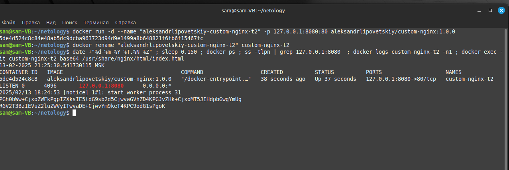
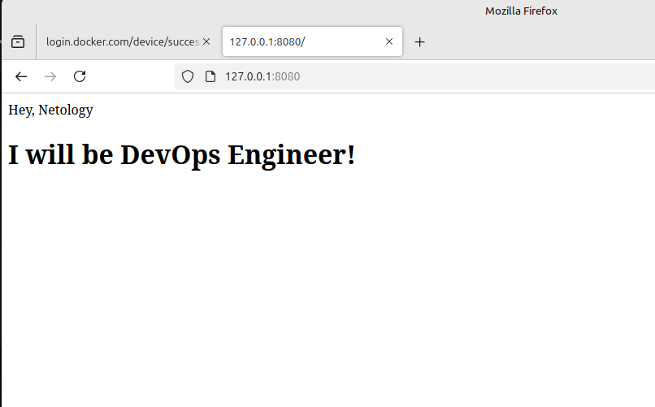
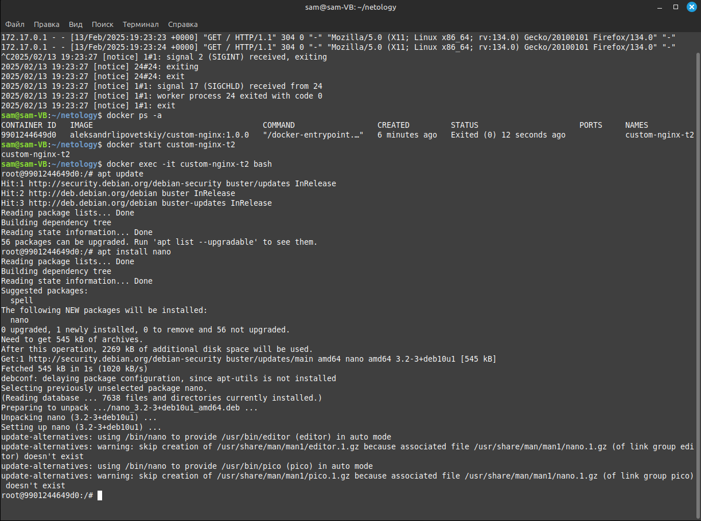
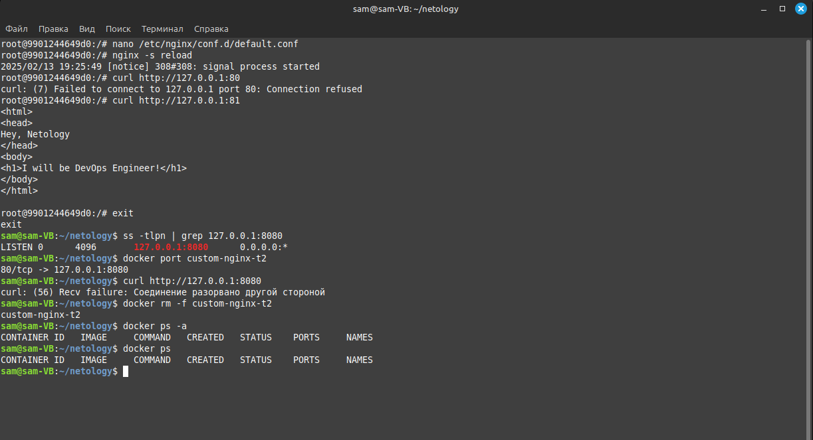
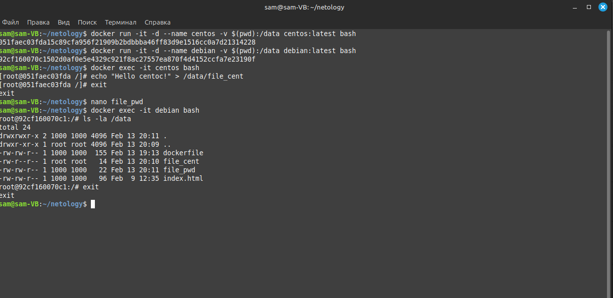

# Домашнее задание к занятию «Оркестрация группой Docker контейнеров на примере Docker Compose» - Липовецкий Александр  

## Ответ на задание 1  

[Ссылка на докер образ "custom-nginx"](https://hub.docker.com/repository/docker/aleksandrlipovetskiy/custom-nginx/general)  

## Ответ на задание 2  

```bash
docker run -d --name "aleksandrlipovetskiy-custom-nginx-t2" -p 127.0.0.1:8080:80 aleksandrlipovetskiy/custom-nginx:1.0.0
```   

```bash
docker rename "aleksandrlipovetskiy-custom-nginx-t2" custom-nginx-t2
```   

Выполненные команды:  
   

Скриншот работы nginx в обозревателе:  
  

## Ответ на задание 3  

Выполненные команды:  
   

Выполненные команды:  
 

После выполнения команды docker attach, все, что вы вводите в терминале, будет передано в стандартный поток ввода контейнера. Следователь, при вводе команды Ctrl-C в поток ввода docker контейнера будет передана команда остановки "signal 2 (SIGINT)".

После изменения, серевер внутри контейнера не настроен на прослушивание порта 80, а сетевая связь настроена между портами 8080 хоста и портом 80 контейнера. То есть получается сетевая связь есть, но нет ответа сервера nginx, а на 81 порт сетевой связи нет.  

## Ответ на задание 4  

Выполненные команды:  
  

## Ответ на задание 5  

Потратил некоторое время на проблему с установкой nano внутрь контейнера, поэтому дальше не продвинулся.  
Проблема была во втором включенном сетевом интерфейсе на виртуальной машине.

