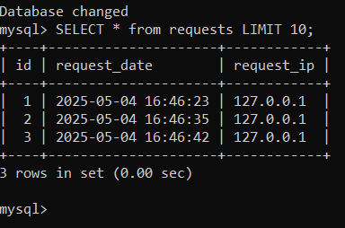
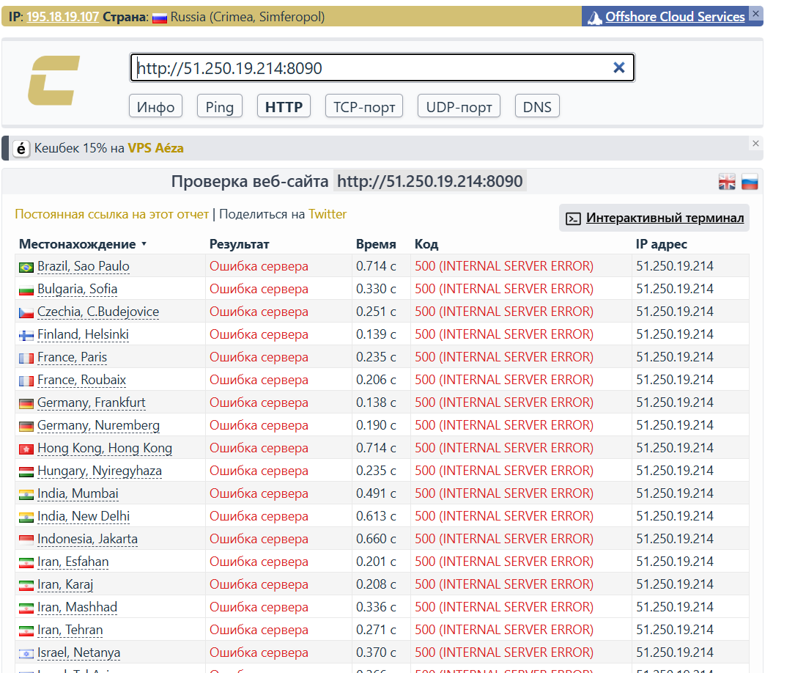
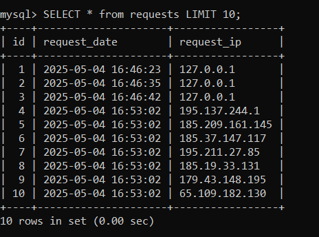
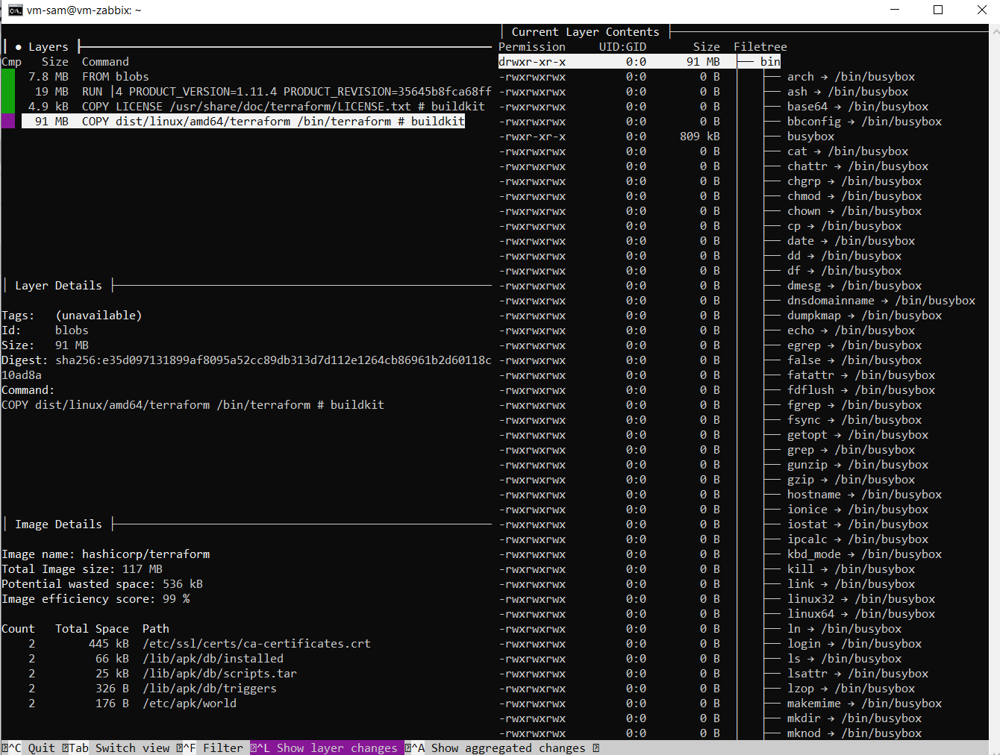

# Домашнее задание к занятию «Практическое применение Docker» - Липовецкий Александр  

## Ответ на задание 1  

Ссылка на Dockerfile.python  
[Ссылка1](https://github.com/AleksandrLipovetskiy/shvirtd-example-python/blob/main/Dockerfile.python)  

## Ответ на задание 3

Изначально использовал удаленную машину на YC, в этом задании будет как локальная.  

Ссылка на файл compose.yaml  
[Ссылка2](https://github.com/AleksandrLipovetskiy/shvirtd-example-python/blob/main/compose.yaml)  

curl выводит IP адрес и время как указано в задании.  

Скиншот выводв SQL запоса.  
  

## Ответ на задание 4  
  
Создал скрипт deploy_app.sh, который скачает fork-репозиторий в каталог /opt и запустит проект целиком.  
[Ссылка3](https://github.com/AleksandrLipovetskiy/DevOps_netology_hw/blob/develop/15_VirtCont/15_2_Practical/deploy_app.sh)  

Скриншот сайта check-host.  
  

Скиншот выводв SQL запоса.  
  

Ссылка на fork-репозиторий.  
[Ссылка4](https://github.com/AleksandrLipovetskiy/shvirtd-example-python)  

## Ответ на задание 6  

Скриншот Dive.  
  

Скриншот docker save.  
[Скрин5](./docker_save_terr.PNG)  

далее выполнил команду
```bash
tar xf terraform.tar
```
Скриншот docker save2.  
[Скрин6](./docker_save_terr2.PNG)  


## Ответ на задане 6.1  
Для аналогичного результата, используя docker cp, выполнил команды

```bash
docker create --name temp hashicorp/terraform:latest
docker cp temp:/bin/terraform ./terraform
docker rm temp
```
Скриншот выполнения.
[Скрин6.1](./docker_cp.PNG)


