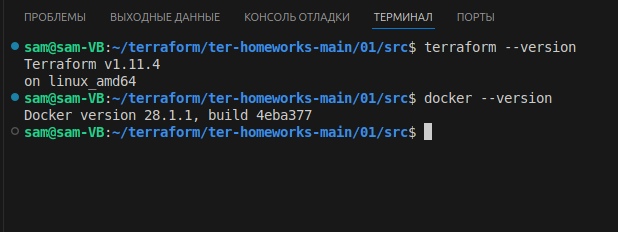
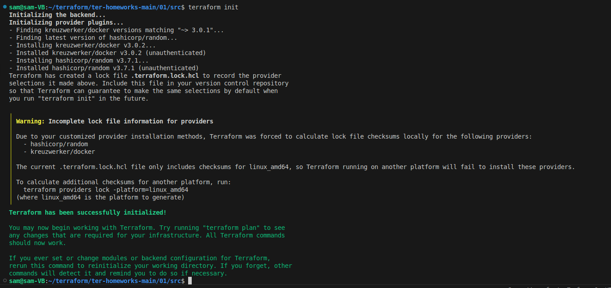
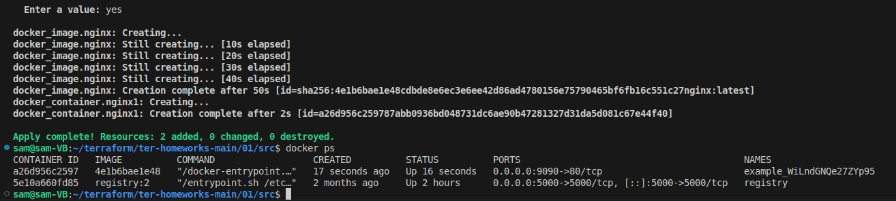
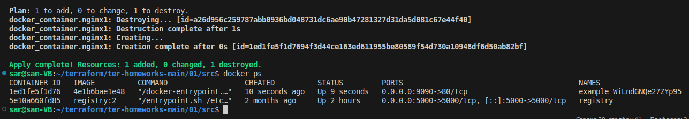

# Домашнее задание к занятию «Введение в Terraform» - Липовецкий Александр  
  
## Чек-лист готовности к домашнему заданию  
1. Скачайте и установите Terraform версии >=1.8.4 . Приложите скриншот вывода команды terraform --version.  
2. Скачайте на свой ПК этот git-репозиторий. Исходный код для выполнения задания расположен в директории 01/src.  
3. Убедитесь, что в вашей ОС установлен docker.  
  
Скриншот версии terraform:  
  

## Задание 1  
1. Перейдите в каталог src. Скачайте все необходимые зависимости, использованные в проекте.  
2. Изучите файл .gitignore. В каком terraform-файле, согласно этому .gitignore, допустимо сохранить личную, секретную информацию?(логины,пароли,ключи,токены итд)  
3. Выполните код проекта. Найдите в state-файле секретное содержимое созданного ресурса random_password, пришлите в качестве ответа конкретный ключ и его значение.  
4. Раскомментируйте блок кода, примерно расположенный на строчках 29–42 файла main.tf. Выполните команду terraform validate. Объясните, в чём заключаются намеренно допущенные ошибки. Исправьте их.  
5. Выполните код. В качестве ответа приложите: исправленный фрагмент кода и вывод команды docker ps.  
6. Замените имя docker-контейнера в блоке кода на hello_world. Не перепутайте имя контейнера и имя образа. Мы всё ещё продолжаем использовать name = "nginx:latest". Выполните команду terraform apply -auto-approve. Объясните своими словами, в чём может быть опасность применения ключа -auto-approve. Догадайтесь или нагуглите зачем может пригодиться данный ключ? В качестве ответа дополнительно приложите вывод команды docker ps.  
7. Уничтожьте созданные ресурсы с помощью terraform. Убедитесь, что все ресурсы удалены. Приложите содержимое файла terraform.tfstate.  
8. Объясните, почему при этом не был удалён docker-образ nginx:latest. Ответ ОБЯЗАТЕЛЬНО НАЙДИТЕ В ПРЕДОСТАВЛЕННОМ КОДЕ, а затем ОБЯЗАТЕЛЬНО ПОДКРЕПИТЕ строчкой из документации terraform провайдера docker. (ищите в классификаторе resource docker_image )  

## Ответы на задание 1  

1.  
Скриншот terraform init:  
    

2.  
В файле personal.auto.tfvars допустимо сохранить личную, секретную информацию (логины,пароли,ключи,токены итд), добавленном в .gitignore

3.  
"result": "WiLndGNQe27ZYp95"  

4.  
```bash
sam@sam-VB:~/terraform/ter-homeworks-main/01/src$ terraform validate
╷
│ Error: Missing name for resource
│ 
│   on main.tf line 24, in resource "docker_image":
│   24: resource "docker_image" {
│ 
│ All resource blocks must have 2 labels (type, name).
╵
╷
│ Error: Invalid resource name
│ 
│   on main.tf line 29, in resource "docker_container" "1nginx":
│   29: resource "docker_container" "1nginx" {
│ 
│ A name must start with a letter or underscore and may contain only letters, digits, underscores, and dashes.
```
resource "docker_image" { - тут необходимо было указать имя ресурса - resource "docker_image" "nginx" {  

resource "docker_container" "1nginx" { - имя не должно начинаться с цифры, можно использовать - resource "docker_container" "nginx1" {

name  = "example_${random_password.random_string_FAKE.resulT}" - тут заглавные буквы нужно изменить на строчные, и верное написание "name": "random_string", _FAKE лишнее  

5.  
```bash
resource "docker_image" "nginx" {
  name         = "nginx:latest"
  keep_locally = true
}

resource "docker_container" "nginx1" {
  image = docker_image.nginx.image_id
  name  = "example_${random_password.random_string.result}"

  ports {
    internal = 80
    external = 9090
  }
}
```  
  
Скриншт вывода docker ps  
  

6.  
Terraform перед применением изменений показывает план (preview) и запрашивает подтверждение пользователя (ввод yes). Ключ -auto-approve пропускает этот шаг подтверждения, автоматически применяя изменения без предварительного просмотра или запроса согласия. Если в коде Terraform есть ошибки, использование -auto-approve не даст возможности заметить их до применения. Это может привести к созданию некорректной инфраструктуры или сбою в процессе применения.  
Данный ключ будет полезен в автоматизированных пайплайнах непрерывной интеграции и доставки (CI/CD), его использование позволяет применять изменения без необходимости интерактивного ввода, что ускорит процесс развертывания инфраструктуры, например в тестовых средах, где критичность не так велика как в проде.  

Скриншт вывода docker ps после -auto-approve  
  

7.  
Файл terraform.tfstate  
[terraform.tfstate](./terraform.tfstate)   

8.  
В коде keep_locally = true необходимо заменить на keep_locally = false  

[Ссылка на документацию](https://registry.terraform.io/providers/kreuzwerker/docker/latest/docs/resources/image)  

keep_locally (Boolean) If true, then the Docker image won't be deleted on destroy operation. If this is false, it will delete the image from the docker local storage on destroy operation.  