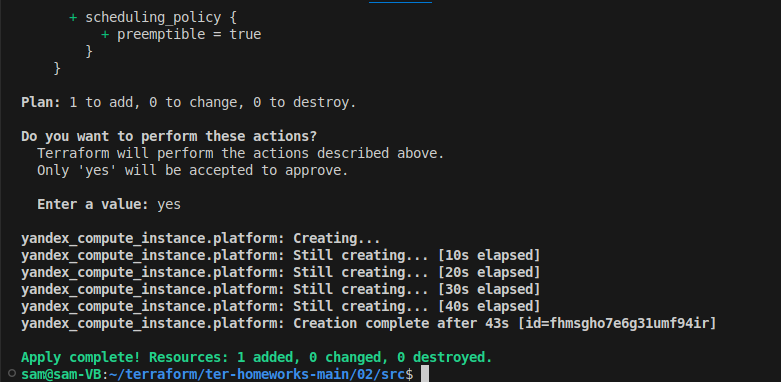
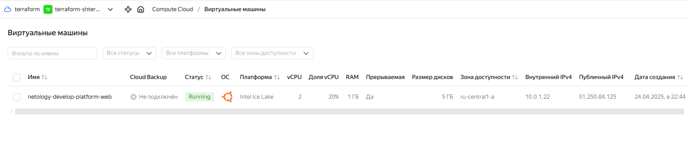
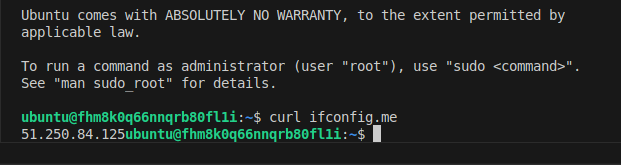
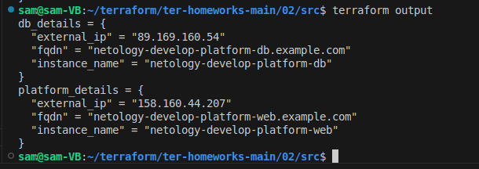
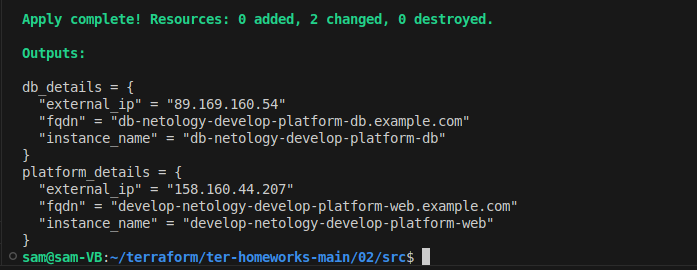

# Домашнее задание к занятию «Основы Terraform. Yandex Cloud» - Липовецкий Александр  
  
## Ответы на задание 1  
  
1.2.3. - выполнено  
4.   
Неверно указан путь к файлу авторизауции в домашней директории пользователя. Он у меня рассположен ~/.duty-hw-key.json . 
Переменную var.vms_ssh_root_key я переименовал в var.vms_ssh_pablic_root_key, как в задании, поэтому возникла ошибка, при ссылке на нее по старому названию.  
"standart-v4", не существует или написан с ошибкой. В итоге оба варината. Необходимо platform_id = "standard-v3" так как v4 не существует и в конце нужна d.  
Загрузка процессора core_fraction = 5, не может быть 5, только 20, 50 или 100 для platform_id = "standard-v3".  
Колличество ядер cores = 1 не может быть 1, либо 2 или 4 для platform_id = "standard-v3".  
  
Terraform apply успешно отработал.  
  
  
*preemptible = true* означает, что виртуальная машина создаётся в прерываемом режиме  
  
*core_fraction* определяет, какую долю вычислительной мощности ядра (в процентах) будет использовать виртуальная машина  
  
Оба эти параметра позволяют экономить на стоимости ресурсов, так как для обучения не важжна вычислительная мощность и не критично прерывание виртуальной машины в любой момент, так как при этом не будет потеряна проделная работа.  
  
Скриншот ЛК Yandex Cloud с созданной ВМ, где видно внешний ip-адрес:  
  
  
Cкриншот консоли, curl должен отобразить тот же внешний ip-адрес:  
  
   
## Ответы на задание 2   
  
Изменил хардкод на переменные.  
  
## Ответы на задание 3  
  
Добавил вторую виртуальную машину. Пришлось все поправить, так как при выполнении задания 4 обнаружил ошибки в третьем.  
  
## Ответы на задание 4  
  
Добавил outputs.tf  
  
Скриншот выполнения команды terraform output  
  
  
## Ответы на задание 5  
  
Добавил locals.tf  
  
Скриншот выполнения apply после добавления locals  
  
  
## Ответы на задание 6  
  
Добавил vms_resources и vms_metadata. terraform plan - изменений не требуется  
Переменных, которые необходимо закомментировать, нет.  

