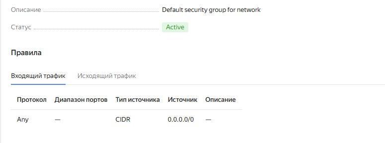
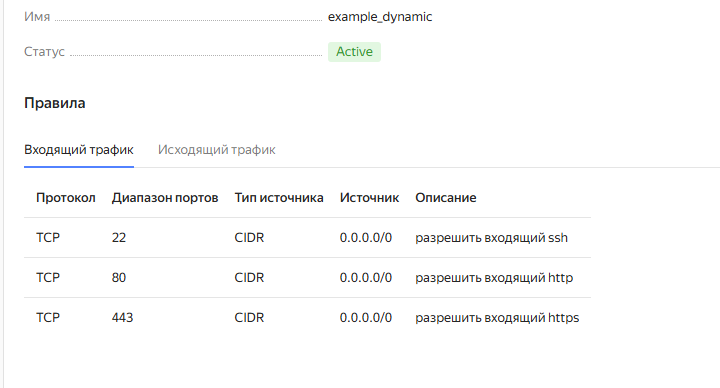
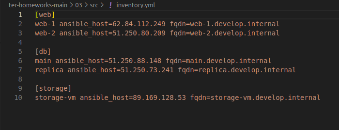

# Домашнее задание к занятию «Управляющие конструкции в коде Terraform» - Липовецкий Александр  
  
## Ответы на задание 1  
  
Правила сеть
  
  
Правила подсеть  
  
  
## Ответы на задание 2  
  
Создал файлы count-vm.tf и for_each-vm.tf.  

## Ответы на задание 3  
  
Создал 3 виртуальных диска и одиночную ВМ с именем storage.  
  
## Ответы на задание 4  

Создал ansible.tf после чего создал inventory-файл для ansible

  
