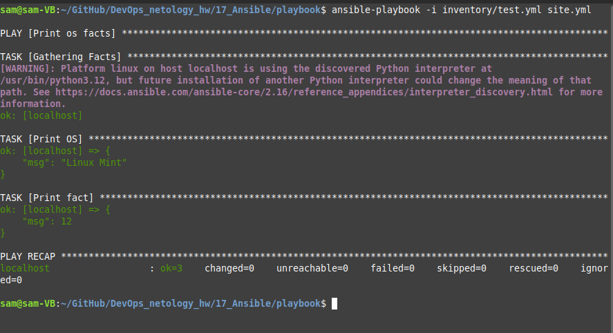
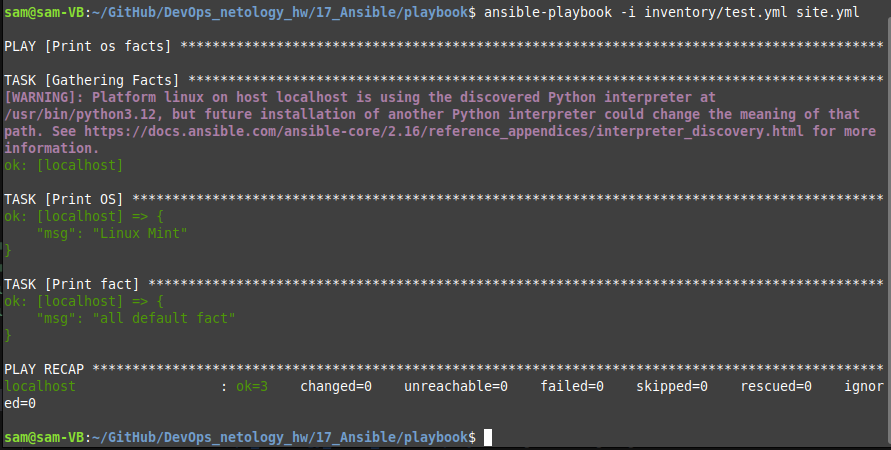
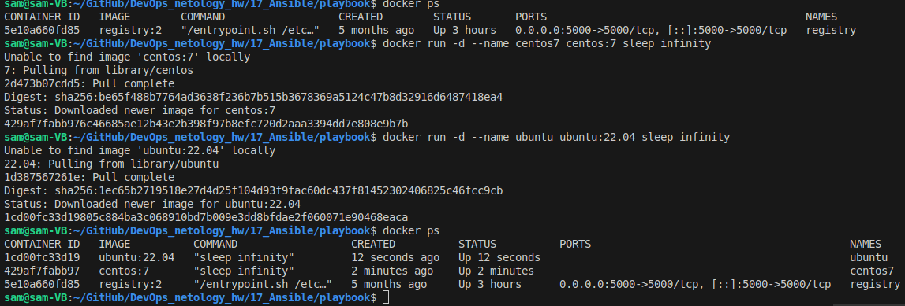
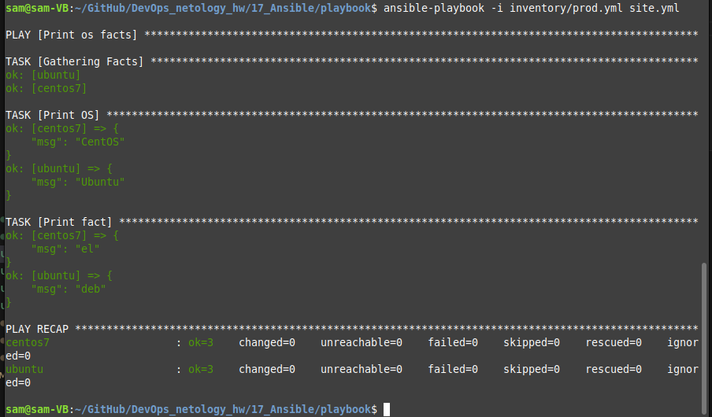
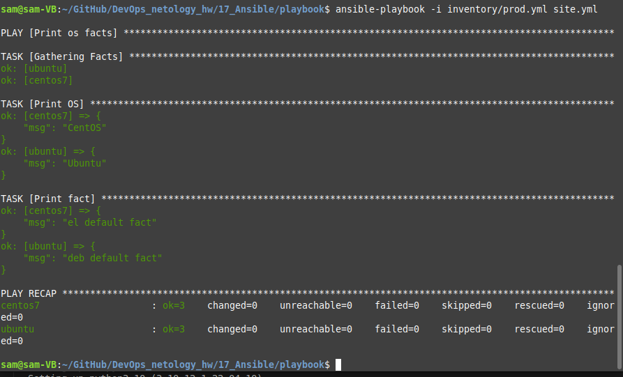
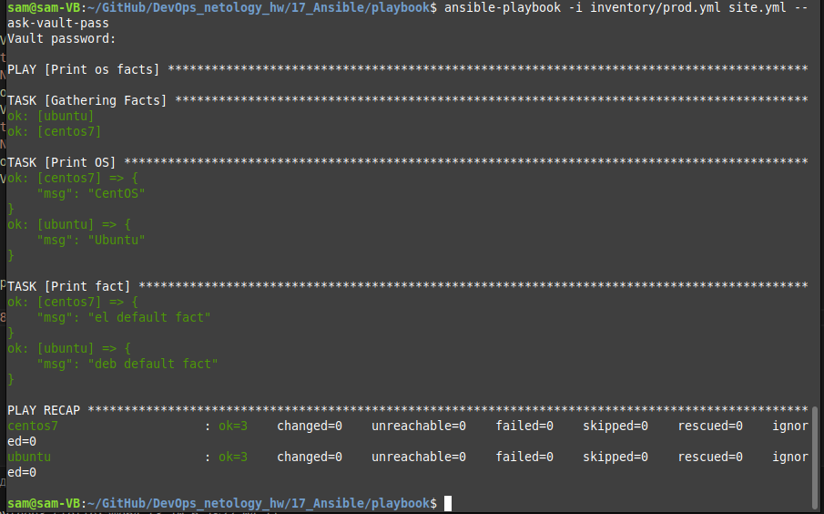
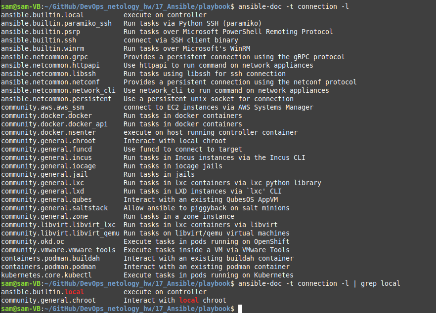
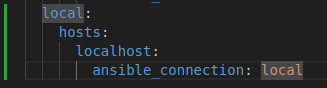
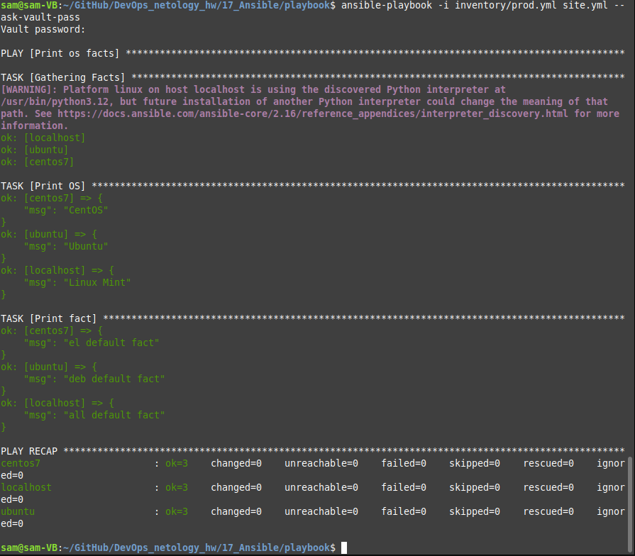

# Домашнее задание к занятию «Введение в Ansible - Липовецкий Александр  
  
## Чек-лист готовности к домашнему заданию  
1. Установите Ansible версии 2.10 или выше.  
2. Создайте свой публичный репозиторий на GitHub с произвольным именем.  
3. Скачайте Playbook из репозитория с домашним заданием и перенесите его в свой репозиторий.  
  
Скриншот версии terraform:  
  
  
## Задание 1  
1. Попробуйте запустить playbook на окружении из `test.yml`, зафиксируйте значение, которое имеет факт `some_fact` для указанного хоста при выполнении playbook.  
2. Найдите файл с переменными (group_vars), в котором задаётся найденное в первом пункте значение, и поменяйте его на `all default fact`.  
3. Воспользуйтесь подготовленным (используется `docker`) или создайте собственное окружение для проведения дальнейших испытаний.  
4. Проведите запуск playbook на окружении из `prod.yml`. Зафиксируйте полученные значения `some_fact` для каждого из `managed host`.  
5. Добавьте факты в `group_vars` каждой из групп хостов так, чтобы для `some_fact` получились значения: для `deb` — `deb default fact`, для `el` — `el default fact`.  
6.  Повторите запуск playbook на окружении `prod.yml`. Убедитесь, что выдаются корректные значения для всех хостов.  
7. При помощи `ansible-vault` зашифруйте факты в `group_vars/deb` и `group_vars/el` с паролем `netology`.  
8. Запустите playbook на окружении `prod.yml`. При запуске `ansible` должен запросить у вас пароль. Убедитесь в работоспособности.  
9. Посмотрите при помощи `ansible-doc` список плагинов для подключения. Выберите подходящий для работы на `control node`.  
10. В `prod.yml` добавьте новую группу хостов с именем  `local`, в ней разместите localhost с необходимым типом подключения.  
11. Запустите playbook на окружении `prod.yml`. При запуске `ansible` должен запросить у вас пароль. Убедитесь, что факты `some_fact` для каждого из хостов определены из верных `group_vars`.  
12. Заполните `README.md` ответами на вопросы. Сделайте `git push` в ветку `master`. В ответе отправьте ссылку на ваш открытый репозиторий с изменённым `playbook` и заполненным `README.md`.  
13. Предоставьте скриншоты результатов запуска команд.  
  
## Ответы на задание 1  
  
1.  
Скриншот выполнения команды  
``` bash
ansible-playbook -i inventory/test.yml site.yml   
```   
  
  
2.  
В файле 17_Ansible/playbook/group_vars/all/examp.yml изменидл значение 12 на all default fact.  
  
Скриншот выполнения команды  
``` bash
ansible-playbook -i inventory/test.yml site.yml   
```   
   
  
3.  
Создал два образа centos7 и ubuntu  
  
   
  
На ubuntu дополнительно поставил python3.  
   
4.   
Скриншот выполнения команды  
``` bash
ansible-playbook -i inventory/prod.yml site.yml   
```   
    
   
5.  
Внес изменения в файлы examp.yml в директориях deb и el  
  
6.  
Скриншот выполнения команды  
``` bash
ansible-playbook -i inventory/prod.yml site.yml   
```   
    
  
7.  
```bash
sam@sam-VB:~/GitHub/DevOps_netology_hw/17_Ansible/playbook$ ansible-vault encrypt group_vars/deb/examp.yml  
New Vault password:  
Confirm New Vault password:  
Encryption successful  
sam@sam-VB:~/GitHub/DevOps_netology_hw/17_Ansible/playbook$ ansible-vault encrypt group_vars/el/examp.yml  
New Vault password:  
Confirm New Vault password:  
Encryption successful  
sam@sam-VB:~/GitHub/DevOps_netology_hw/17_Ansible/playbook$  
```
   
8.  
Скриншот выполнения команды  
``` bash
ansible-playbook -i inventory/prod.yml site.yml --ask-vault-pass  
```   
   
  
9.  
Скриншот выполнения команды  
``` bash
ansible-doc -t connection -l | grep local
```   
  
  
Так как мы работаем на локальной машине, более всего подойдет ansible.builtin.local  
  
10.  
Добавил в prod.yml новую группу хостов.  
  
   
  
11.  
Скриншот выполнения команды  
``` bash
ansible-playbook -i inventory/prod.yml site.yml --ask-vault-pass  
```   
  
  