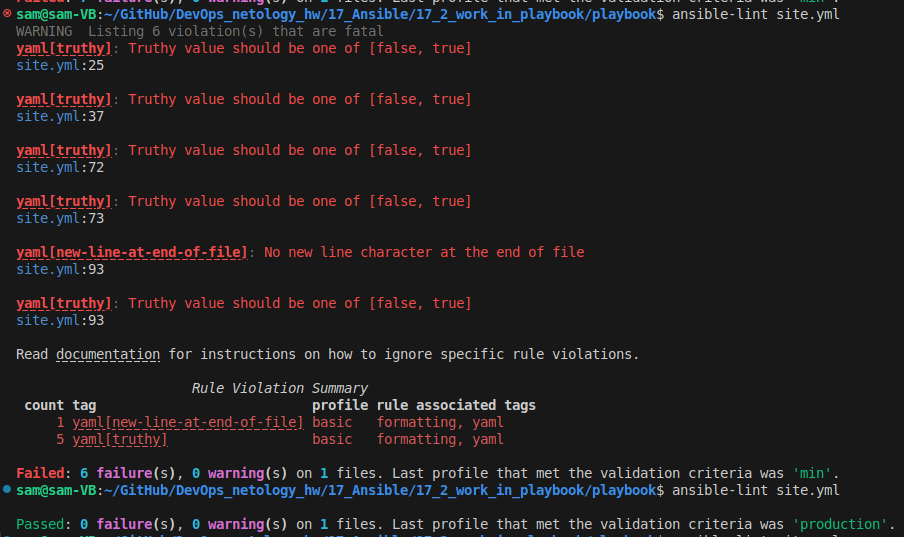
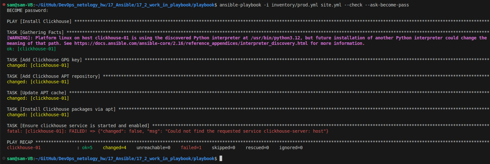
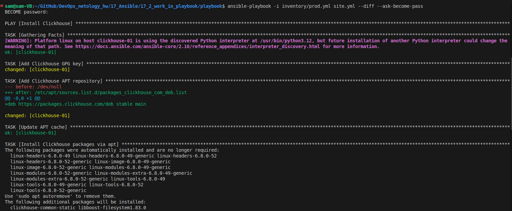
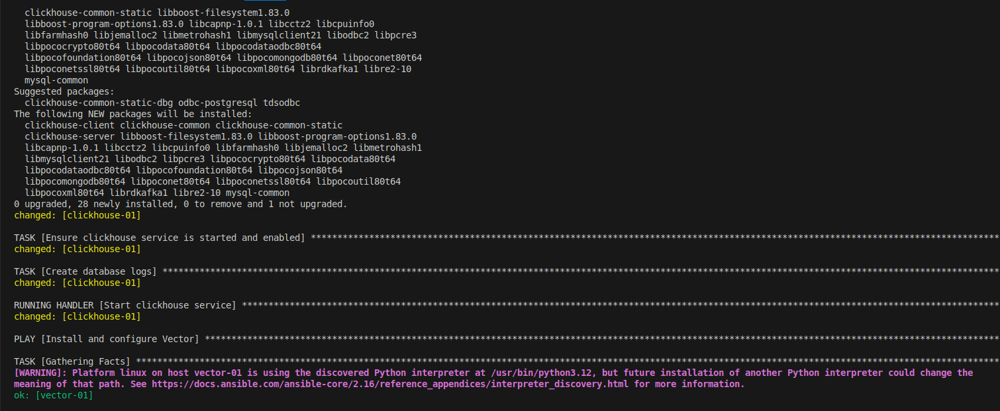
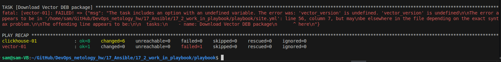
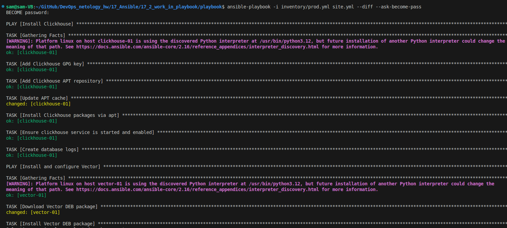
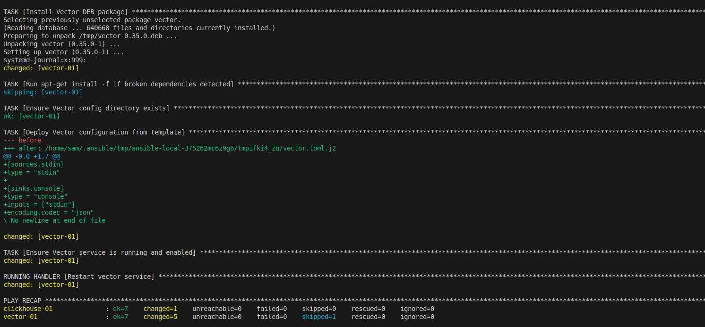
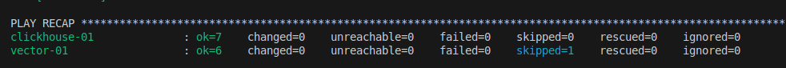

# Домашнее задание к занятию «Работа с Playbook» - Липовецкий Александр  
  
## Подготовка к выполнению
1. * Необязательно. Изучите, что такое [ClickHouse](https://www.youtube.com/watch?v=fjTNS2zkeBs) и [Vector](https://www.youtube.com/watch?v=CgEhyffisLY).
2. Создайте свой публичный репозиторий на GitHub с произвольным именем или используйте старый.
3. Скачайте [Playbook](./playbook/) из репозитория с домашним заданием и перенесите его в свой репозиторий.
4. Подготовьте хосты в соответствии с группами из предподготовленного playbook. 
  
## Задание 1  
1. Подготовьте свой inventory-файл `prod.yml`.
2. Допишите playbook: нужно сделать ещё один play, который устанавливает и настраивает [vector](https://vector.dev). Конфигурация vector должна деплоиться через template файл jinja2. От вас не требуется использовать все возможности шаблонизатора, просто вставьте стандартный конфиг в template файл. Информация по шаблонам по [ссылке](https://www.dmosk.ru/instruktions.php?object=ansible-nginx-install). не забудьте сделать handler на перезапуск vector в случае изменения конфигурации!
3. При создании tasks рекомендую использовать модули: `get_url`, `template`, `unarchive`, `file`.
4. Tasks должны: скачать дистрибутив нужной версии, выполнить распаковку в выбранную директорию, установить vector.
5. Запустите `ansible-lint site.yml` и исправьте ошибки, если они есть.
6. Попробуйте запустить playbook на этом окружении с флагом `--check`.
7. Запустите playbook на `prod.yml` окружении с флагом `--diff`. Убедитесь, что изменения на системе произведены.
8. Повторно запустите playbook с флагом `--diff` и убедитесь, что playbook идемпотентен.
9. Подготовьте README.md-файл по своему playbook. В нём должно быть описано: что делает playbook, какие у него есть параметры и теги. Пример качественной документации ansible playbook по [ссылке](https://github.com/opensearch-project/ansible-playbook). Так же приложите скриншоты выполнения заданий №5-8
10. Готовый playbook выложите в свой репозиторий, поставьте тег `08-ansible-02-playbook` на фиксирующий коммит, в ответ предоставьте ссылку на него.
  
## Ответы на задание 1  
  
1.  
Файл подготовил.  
[prod](./playbook/inventory/prod.yml)  
  
2.  
Дописал playbook.  
[site](./playbook/site.yml)  
  
3.  
Учитывал рекомендации.  
  
4.  
Учитывал требования. Тут возникла проблема, пакет не скачивался с офф хранилища, использовал собственный ftp для соблюдения требований.  
   
5.  
Запустил ansible-lint site.yml и исправил возникшие ошибки, убрал лишнее и исправил yes на true.  
  
    
  
6.  
Запустил playbook с флагом --check .  
  
  
  
Проверка не завершалась полностью, так как не был установлен сервис и не было возможности его запустить.  
  
7.  
Запустил playbook на prod.yml окружении с флагом --diff , исправил ряд ошибок, после чего застрял на скачивании пакета с оффициального хранилища, исправил как писал выше.  
  
### Ошибка.  

  
  
### Исправлено.  

 
  
8.    
Повторно запустил playbook с флагом --diff и убедился, что playbook идемпотентен.  
  
   
  
9.  
Файл документации: [README_DOCS](./README_DOCS.md)  
  