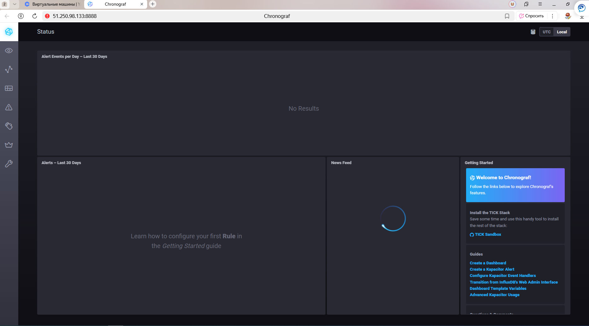
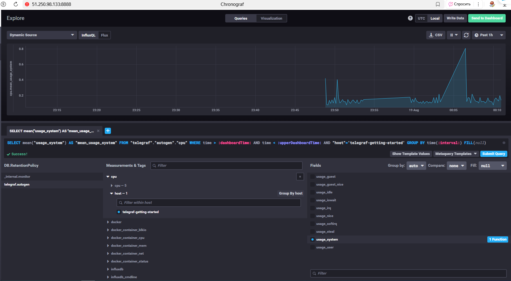

# Домашнее задание к занятию «Системы мониторинга» - Липовецкий Александр  
  
## Задание 1  
Вас пригласили настроить мониторинг на проект. На онбординге вам рассказали, что проект представляет из себя платформу для вычислений с выдачей текстовых отчетов, которые сохраняются на диск. Взаимодействие с платформой осуществляется по протоколу http. Также вам отметили, что вычисления загружают ЦПУ. Какой минимальный набор метрик вы выведите в мониторинг и почему?  
  
## Ответ на задание 1  
  
### 1. Системные метрики (CPU, диск, память) - так как они напрямую связаны с вычислительными задачами, сохранением отчетов, и общим здоровьем сервисов.  
Загрузка ЦПУ (CPU Usage) Критично, так как вычисления нагружают процессор. Высокая загрузка может привести к снижению производительности или отказу сервиса.  
  
Свободное место на диске (Disk Free Space) Текстовые отчеты сохраняются на диск — важно избежать ситуации, когда место закончится.  
  
IOPS/задержка диска (Disk IO/Latency) Высокая задержка или ресурсное давление может привести к ошибкам при сохранении отчетов.  
  
Память (Memory Usage) Недостаток памяти может привести к авариям процесса и потере данных.  
  
### 2. Метрики доступности HTTP - которые отражают, может ли пользователь воспользоваться платформой.  
HTTP Status Codes (2xx, 4xx, 5xx) Это покажет, доступны ли конечные точки и справляется ли сервис с обработкой запросов.  
  
Время ответа HTTP (latency) Позволяет выявить случаи деградации производительности платформы и своевременно реагировать на проблемы.  
  
### 3. Метрики приложений - так как она критична для реактивного мониторинга и быстрого устранения проблем.  
Число обработанных/успешных/ошибочных вычислений. Позволяет оценить работоспособность вычислительного движка.  
  
Ошибки сохранения отчетов. Если есть ошибки при записи файлов — это укажет на проблемы с диском или приложением.  
  
### 4. Логические бизнес-метрики - которые дают понять, насколько платформа выполняет свои задачи и демонстрируют влияние инцидентов на конечных пользователей.  
Скорость генерации отчетов. Можно отслеживать, как отправляются отчеты, и выявлять "узкие места".   
  
## Задание 2   
Менеджер продукта посмотрев на ваши метрики сказал, что ему непонятно что такое RAM/inodes/CPUla. Также он сказал, что хочет понимать, насколько мы выполняем свои обязанности перед клиентами и какое качество обслуживания. Что вы можете ему предложить?  
  
## Ответ на задание 2  
  
* Процент успешно завершённых расчетов  
Показывает, скольким клиентам платформа реально выдает результат, без ошибок.  
  
* Среднее время обработки задачи  
Характеризует, сколько клиенту ждать результат — отражает производительность и скорость обслуживания.  
  
* Процент ошибок отчёта/запроса  
Сколько задач завершилось с ошибкой или не был создан отчет.  
  
* Уровень доступности сервиса  
% времени, когда платформа доступна для работы.  
  
* Скорость реакции на сбои (MTTR — среднее время восстановления)  
Оценивает, насколько оперативно платформа решает возникающие проблемы.  
  
## Задание 3   
Вашей DevOps команде в этом году не выделили финансирование на построение системы сбора логов. Разработчики в свою очередь хотят видеть все ошибки, которые выдают их приложения. Какое решение вы можете предпринять в этой ситуации, чтобы разработчики получали ошибки приложения?  
  
## Ответ на задание 3   
  
1. Использовать встроенные механизмы логирования и настройка удаленного доступа к логам  
2. Рассмотреть бесплатные и встроенные средства мониторинга  
3. Настроить уведомления об ошибках  
  
## Задание 4   
Вы, как опытный SRE, сделали мониторинг, куда вывели отображения выполнения SLA=99% по http кодам ответов. Вычисляете этот параметр по следующей формуле: summ_2xx_requests/summ_all_requests. Данный параметр не поднимается выше 70%, но при этом в вашей системе нет кодов ответа 5xx и 4xx. Где у вас ошибка?  
  
## Ответ на задание 4  
summ_2xx_requests/summ_all_requests не учитывает коды 3xx как успешные, хотя они могуть быть таковыми и их необходимо вклбючить в числитель формулы.  
SLI = (summ_2xx_requests + summ_3xx_requests) / (summ_all_requests)  
  
## Задание 5  
Опишите основные плюсы и минусы pull и push систем мониторинга.  
  
## Ответ на задание 5   
  
### Push-модель подразумевает отправку данных с агентов (рабочих машин, с которых собираем мониторинг) в систему мониторинга, через вспомогательные службы или программы (обычно UDP).  
  
### Pull-модель подразумевает последовательный или параллельный сбор системой мониторинга с агентов накопленной информации из вспомогательных служб.  
  
Плюсы push-модели:  
- упрощение репликации данных в разные системы мониторинга или их резервные копии  
- более гибкая настройка отправки пакетов данных с метриками  
- UDP — это менее затратный способ передачи данных, из-за чего может возрасти производительность сбора метрик.  
  
Плюсы pull-модели:  
- легче контролировать подлинность данных  
- можно настроить единый proxy server до всех агентов с TLS  
- упрощённая отладка получения данных с агентов.  
  
## Задание 6   
Опишите основные плюсы и минусы pull и push систем мониторинга.  
   
## Ответ на задание 6   
  
| Система            | Модель               | Примечания                                                                  |  
|--------------------|----------------------|-----------------------------------------------------------------------------|  
| Prometheus         | Pull                 | Основная модель — pull; push возможен через Pushgateway, но не основная.    |  
| TICK               | Push                 | Агент Telegraf отправляет метрики; pull не поддерживается.                  |  
| Zabbix             | Гибрид (Push + Pull) | Поддерживает обе модели через активные и пассивные агенты.                  |  
| VictoriaMetrics    | Гибрид (Push + Pull) | Основная модель — pull, но поддерживает push через remote write.            |  
| Nagios             | Pull (в основном)    | Основная модель — pull; push возможен через агентов, но редко используется. |  
  
## Задание 7  
Склонируйте себе репозиторий и запустите TICK-стэк, используя технологии docker и docker-compose.  
В виде решения на это упражнение приведите скриншот веб-интерфейса ПО chronograf (http://localhost:8888).  
  
P.S.: если при запуске некоторые контейнеры будут падать с ошибкой - проставьте им режим Z, например ./data:/var/lib:Z  
   
## Ответ на задание 7   
 
  
  
## Задание 8   
Перейдите в веб-интерфейс Chronograf (http://localhost:8888) и откройте вкладку Data explorer.  
  
Нажмите на кнопку Add a query.  
Изучите вывод интерфейса и выберите БД telegraf.autogen.  
В measurments выберите cpu->host->telegraf-getting-started, а в fields выберите usage_system. Внизу появится график утилизации cpu.  
Вверху вы можете увидеть запрос, аналогичный SQL-синтаксису. Поэкспериментируйте с запросом, попробуйте изменить группировку и интервал наблюдений.  
  
## Ответ на задание 8  
  
  
  