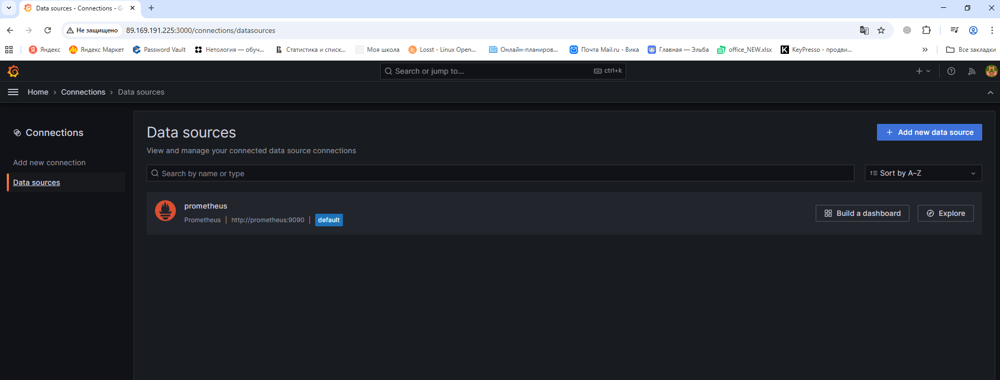
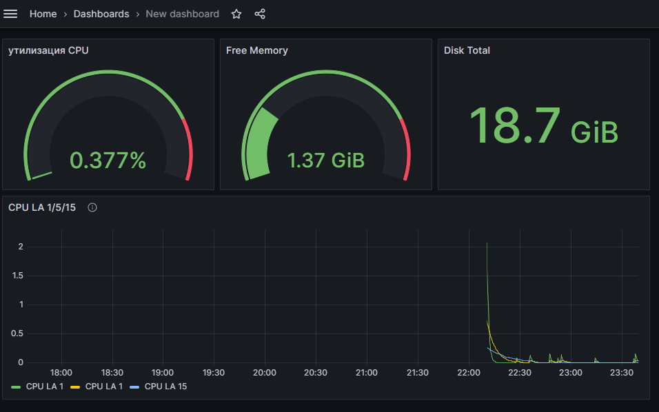
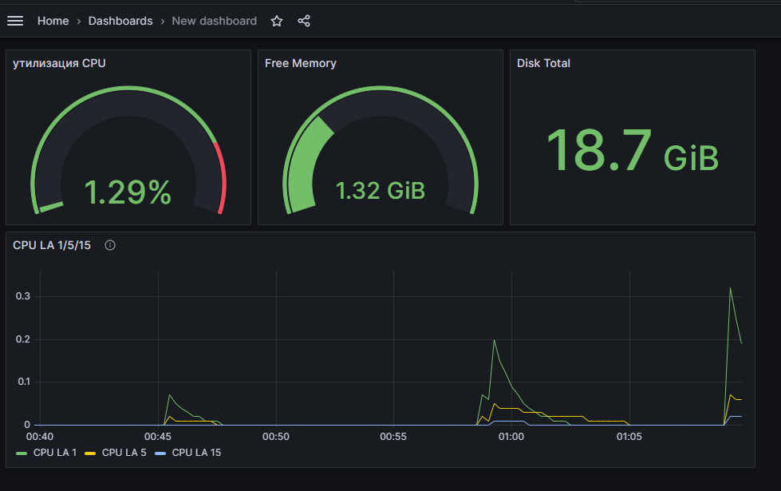
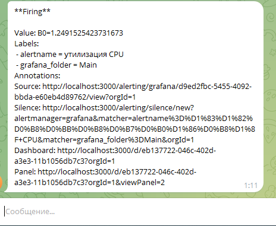

# Домашнее задание к занятию «Средство визуализации Grafana» - Липовецкий Александр  

### в ходе выполнения задания я использовал директорию ./help

## Задание 1  
* Используя директорию help внутри этого домашнего задания, запустите связку prometheus-grafana.
* Зайдите в веб-интерфейс grafana, используя авторизационные данные, указанные в манифесте docker-compose.
* Подключите поднятый вами prometheus, как источник данных.
Решение домашнего задания — скриншот веб-интерфейса grafana со списком подключенных Datasource.
  
## Ответ на задание 1  
  
  
  
## Задание 2  
Создайте Dashboard и в ней создайте Panels:
* утилизация CPU для nodeexporter (в процентах, 100-idle);
* CPULA 1/5/15;
* количество свободной оперативной памяти;
* количество места на файловой системе.
Для решения этого задания приведите promql-запросы для выдачи этих метрик, а также скриншот получившейся Dashboard.

## Ответ на задание 2  
  
* утилизация CPU для nodeexporter (в процентах, 100-idle)  
```promql  
100 - (avg by(instance) (rate(node_cpu_seconds_total{mode="idle"}[5m])) * 100)  
```  
* CPULA 1/5/15  
```promql  
node_load1  
node_load5  
node_load15  
```  
* количество свободной оперативной памяти  
```promql  
node_memory_MemFree_bytes  
```  
* количество места на файловой системе   
```promql  
node_filesystem_size_bytes{mountpoint="/"}  
```  
  
  
  
## Задание 3   
Создайте для каждой Dashboard подходящее правило alert — можно обратиться к первой лекции в блоке «Мониторинг».  
В качестве решения задания приведите скриншот вашей итоговой Dashboard.  
  
## Ответ на задание 3   
  
  
  
Полученное уведомление в телеграм, да не идеально, но я только учусь ))

  
  
## Задание 4   
Сохраните ваш Dashboard.Для этого перейдите в настройки Dashboard, выберите в боковом меню «JSON MODEL». Далее скопируйте отображаемое json-содержимое в отдельный файл и сохраните его.  
В качестве решения задания приведите листинг этого файла.  
  
## Ответ на задание 4  
  
Файл с листингом JSON-содержимого дашборда.  
  
[Листинг](./listing.txt) 
  