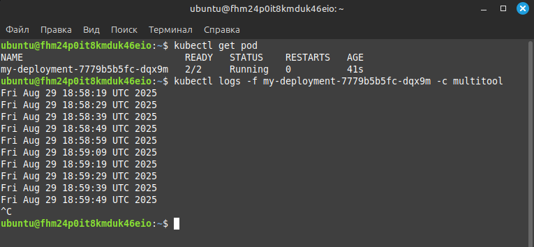
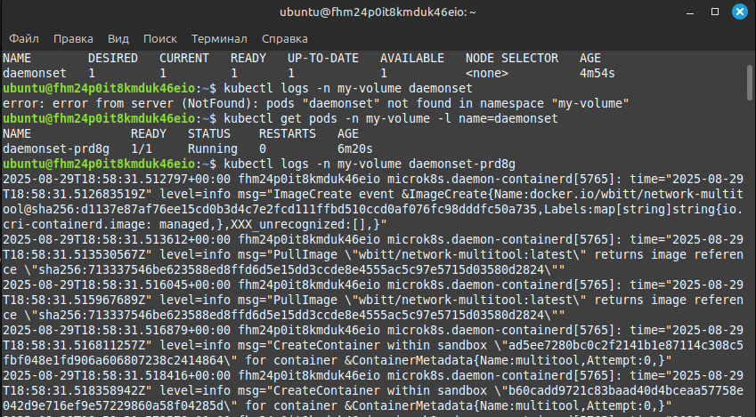

# Домашнее задание к занятию «Хранение в K8s. Часть 1» - Липовецкий Александр  
  
## Задание 1. Создать Deployment приложения, состоящего из двух контейнеров и обменивающихся данными.
  
* Создать Deployment приложения, состоящего из контейнеров busybox и multitool.  
* Сделать так, чтобы busybox писал каждые пять секунд в некий файл в общей директории.  
* Обеспечить возможность чтения файла контейнером multitool.  
* Продемонстрировать, что multitool может читать файл, который периодоически обновляется.  
* Предоставить манифесты Deployment в решении, а также скриншоты или вывод команды из п. 4.   
    
## Ответ на задание 1  
     
Развернута и настроена инфраструктура при помощи terraform и ansible, в том числе подняты поды и сервис.   
Для удобства использования написан скрипт **mk8s** для запуска и удаления проекта.   
Запуск производиться из директории ./IaC .  
  
```bash  
# команда запуска  
./mk8s start  
# команда удаления  
./mk8s down  
```   
Ссылка на манифест [deploy](./IaC/playbook/files/deploy.yaml)  
  
Скриншот демонстрации, что multitool может читать файл, который периодоически обновляется.   
   
  
  
## Задание 2. Создать DaemonSet приложения, которое может прочитать логи ноды.
   
* Создать DaemonSet приложения, состоящего из multitool.  
* Обеспечить возможность чтения файла /var/log/syslog кластера MicroK8S.  
* Продемонстрировать возможность чтения файла изнутри пода.  
* Предоставить манифесты Deployment, а также скриншоты или вывод команды из п. 2.  
  
## Ответ на задание 2  
  
Ссылка на манифест [daemonset](./IaC/playbook/files/daemonset.yaml)  
  
Скриншот возможности чтения файла изнутри пода.  
  
  
  