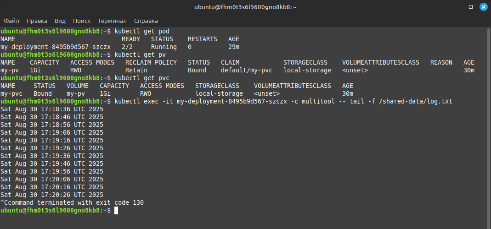
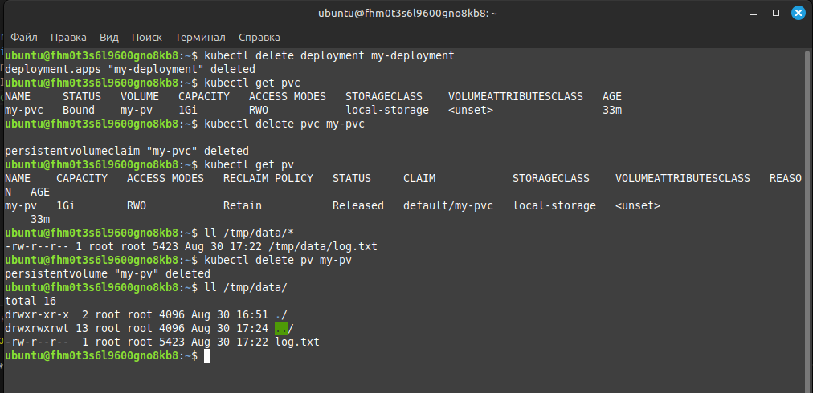

# Домашнее задание к занятию «Хранение в K8s. Часть 2» - Липовецкий Александр  
  
## Задание 1. Создать Deployment приложения, использующего локальный PV, созданный вручную.  
  
* Создать Deployment приложения, состоящего из контейнеров busybox и multitool.  
* Создать PV и PVC для подключения папки на локальной ноде, которая будет использована в поде.  
* Продемонстрировать, что multitool может читать файл, в который busybox пишет каждые пять секунд в общей директории. 
* Удалить Deployment и PVC. Продемонстрировать, что после этого произошло с PV. Пояснить, почему.  
* Продемонстрировать, что файл сохранился на локальном диске ноды. Удалить PV. Продемонстрировать что произошло с файлом после удаления PV. Пояснить, почему.  
* Предоставить манифесты, а также скриншоты или вывод необходимых команд.  
    
## Ответ на задание 1  
     
Развернута и настроена инфраструктура при помощи terraform и ansible, в том числе подняты поды и сервис.   
Для удобства использования написан скрипт **mk8s** для запуска и удаления проекта.   
Запуск производиться из директории ./IaC .  
  
```bash  
# команда запуска  
./mk8s start  
# команда удаления  
./mk8s down  
```   
Ссылка на манифест [deploy](./IaC/playbook/files/deploy.yaml)  

Ссылка на манифест [pv](./IaC/playbook/files/pv.yaml) 

Ссылка на манифест [pvc](./IaC/playbook/files/pvc.yaml) 

Скриншот демонстрации, что multitool может читать файл.   
   
  
  
PV остаётся в системе в статусе Released, данные сохраняются, но том становится недоступен для новых PVC до ручного вмешательства. Нужно вручную очистить или удалить PV, если он больше не нужен.  
  
## Задание 2. Создать Deployment приложения, которое может хранить файлы на NFS с динамическим созданием PV.  
   
* Включить и настроить NFS-сервер на MicroK8S.  
* Создать Deployment приложения состоящего из multitool, и подключить к нему PV, созданный автоматически на сервере NFS.  
* Продемонстрировать возможность чтения и записи файла изнутри пода.  
* Предоставить манифесты, а также скриншоты или вывод необходимых команд. 
  
## Ответ на задание 2  
  
Ссылка на манифест [daemonset](./IaC/playbook/files/daemonset.yaml)  
  
Скриншот возможности чтения файла изнутри пода.  
  
  
  
Файл остался на ноде после удаления тома, так как используется политика Retain.  
  