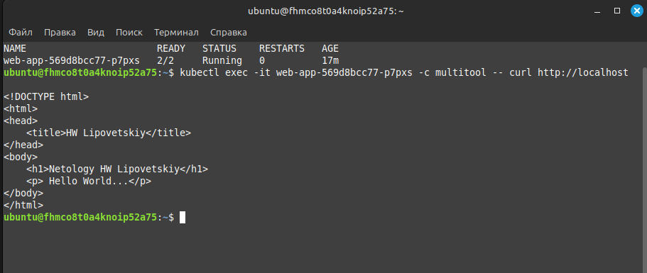
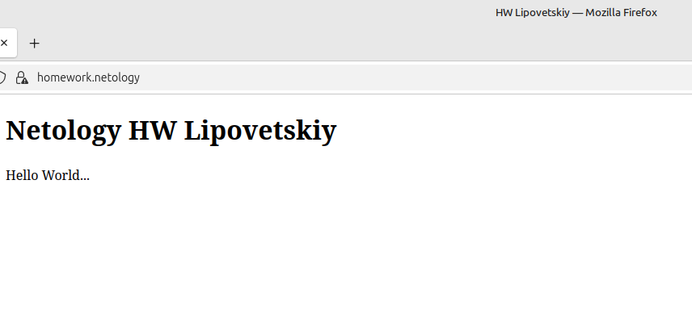

# Домашнее задание к занятию «Конфигурация приложений» - Липовецкий Александр  
  
## Задание 1. Создать Deployment приложения и решить возникшую проблему с помощью ConfigMap. Добавить веб-страницу
  
* Создать Deployment приложения, состоящего из контейнеров nginx и multitool.  
* Решить возникшую проблему с помощью ConfigMap.  
* Продемонстрировать, что pod стартовал и оба конейнера работают.  
* Сделать простую веб-страницу и подключить её к Nginx с помощью ConfigMap. Подключить Service и показать вывод curl или в браузере.  
* Предоставить манифесты, а также скриншоты или вывод необходимых команд. 
    
## Ответ на задание 1  
     
Развернута и настроена инфраструктура при помощи terraform и ansible, в том числе подняты поды и сервис.   
Для удобства использования написан скрипт **mk8s** для запуска и удаления проекта.   
Запуск производиться из директории ./IaC .  
  
```bash  
# команда запуска  
./mk8s start  
# команда удаления  
./mk8s down  
```   
  
Скриншот вывода результата curl.  
   
  
  
## Задание 2. Создать приложение с вашей веб-страницей, доступной по HTTPS
   
* Создать Deployment приложения, состоящего из Nginx.  
* Создать собственную веб-страницу и подключить её как ConfigMap к приложению.  
* Выпустить самоподписной сертификат SSL. Создать Secret для использования сертификата.  
* Создать Ingress и необходимый Service, подключить к нему SSL в вид. Продемонстировать доступ к приложению по HTTPS.  
* Предоставить манифесты, а также скриншоты или вывод необходимых команд.  
  
## Ответ на задание 2  
  
Ссылка на манифест [conf-html](./IaC/playbook/files/conf-html.yaml)  
  
Ссылка на манифест [conf-nginx](./IaC/playbook/files/conf-nginx.yaml)  
  
Ссылка на манифест [deploy](./IaC/playbook/files/mdeploy.yaml)  
  
Ссылка на манифест [service](./IaC/playbook/files/service.yaml)  
  
Ссылка на манифест [ingress](./IaC/playbook/files/ingress.yaml)  
  
Скриншот вывода запроса в браузере на nginx.  
  
  
  