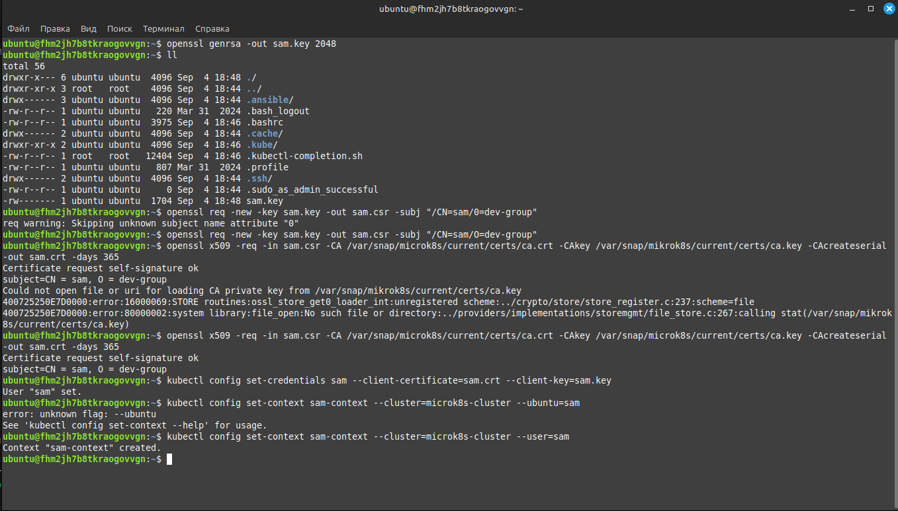
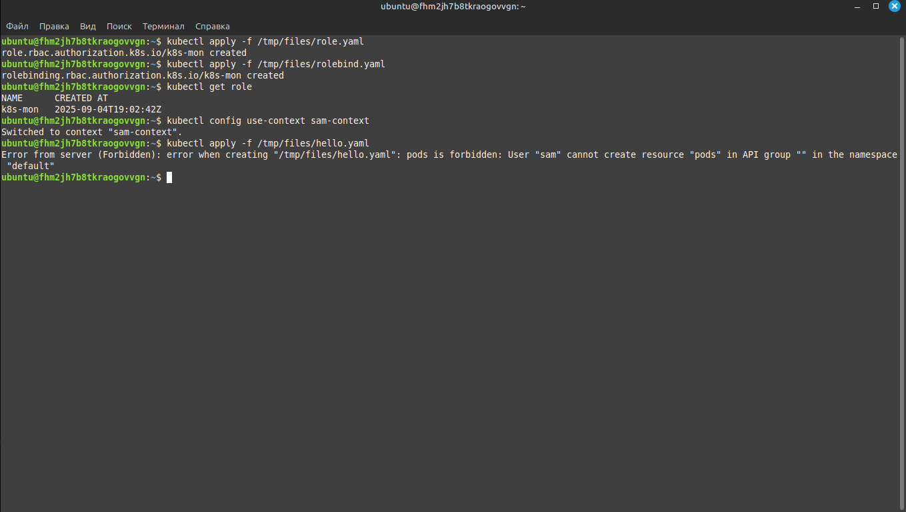
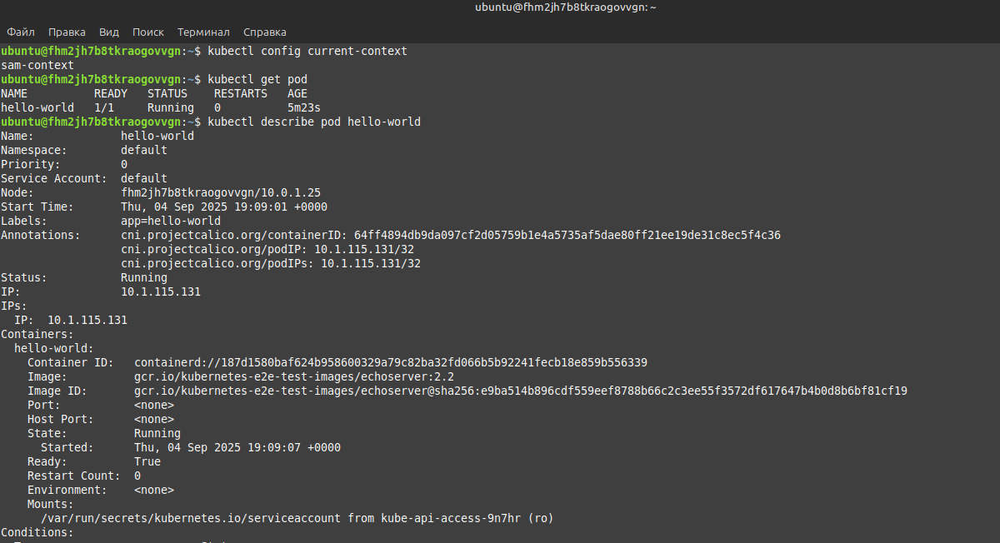
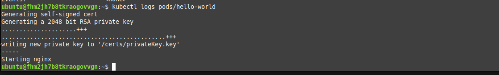

# Домашнее задание к занятию «Управление доступом» - Липовецкий Александр  
  
## Задание 1. Создайте конфигурацию для подключения пользователя
  
* Создайте и подпишите SSL-сертификат для подключения к кластеру.  
* Настройте конфигурационный файл kubectl для подключения.  
* Создайте роли и все необходимые настройки для пользователя.  
* Предусмотрите права пользователя. Пользователь может просматривать логи подов и их конфигурацию (kubectl logs pod <pod_id>, kubectl describe pod <pod_id>).  
* Предоставьте манифесты и скриншоты и/или вывод необходимых команд.  
  
## Ответ на задание 1  
     
Развернута и настроена инфраструктура при помощи terraform и ansible.   
Для удобства использования написан скрипт **mk8s** для запуска и удаления проекта.   
Запуск производиться из директории ./IaC .  
  
```bash  
# команда запуска  
./mk8s start  
# команда удаления  
./mk8s down  
```   
  
Ссылка на манифест [role](./IaC/playbook/files/role.yaml)  
  
Ссылка на манифест [rolebind](./IaC/playbook/files/rolebind.yaml)  
  
Скриншоты выполнения задания.  
  
  
  
  
  
  
  
  
  