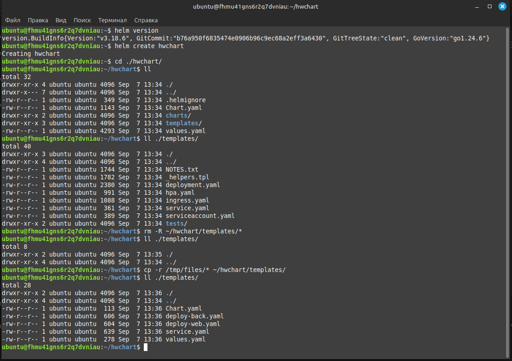
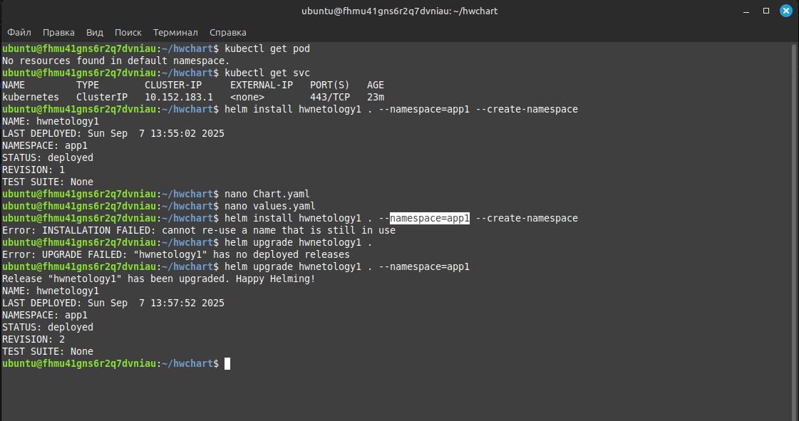
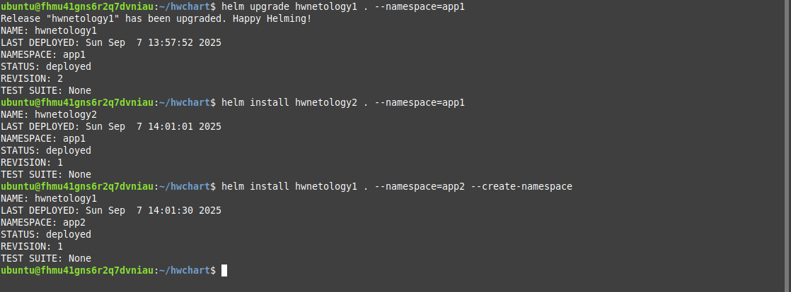
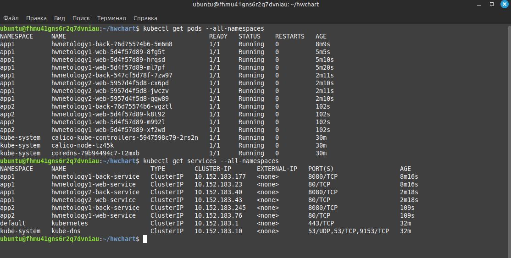

# Домашнее задание к занятию «Helm - Липовецкий Александр  
  
## Задание 1. Подготовить Helm-чарт для приложения
  
* Необходимо упаковать приложение в чарт для деплоя в разные окружения.  
* Каждый компонент приложения деплоится отдельным deployment’ом или statefulset’ом.  
* В переменных чарта измените образ приложения для изменения версии.  
  
## Ответ на задание 1  
     
Развернута и настроена инфраструктура при помощи terraform и ansible.   
Для удобства использования написан скрипт **mk8s** для запуска и удаления проекта.   
Запуск производиться из директории ./IaC .  
  
```bash  
# команда запуска  
./mk8s start  
# команда удаления  
./mk8s down  
```   
  
Ссылка на манифест [deploy-web](./IaC/playbook/files/deploy-web.yaml)  
  
Ссылка на манифест [deploy-back](./IaC/playbook/files/deploy-back.yaml)  
  
Ссылка на манифест [service](./IaC/playbook/files/service.yaml)  
  
Ссылка на манифест [values](./IaC/playbook/files/values.yaml)  
  
Ссылка на манифест [Chart](./IaC/playbook/files/Chart.yaml)  
  
Скриншоты выполнения задания.  
  
  
  
Тут за кадром я перенес файлы values.yaml и Chart.yaml из ./templates в ./ (директорию чарта).  
  
  
  
## Задание 2. Запустить две версии в разных неймспейсах  
  
* Подготовив чарт, необходимо его проверить. Запуститe несколько копий приложения.  
* Одну версию в namespace=app1, вторую версию в том же неймспейсе, третью версию в namespace=app2.  
* Продемонстрируйте результат.  
  
## Ответ на задание 2   
  
  
  
  
  