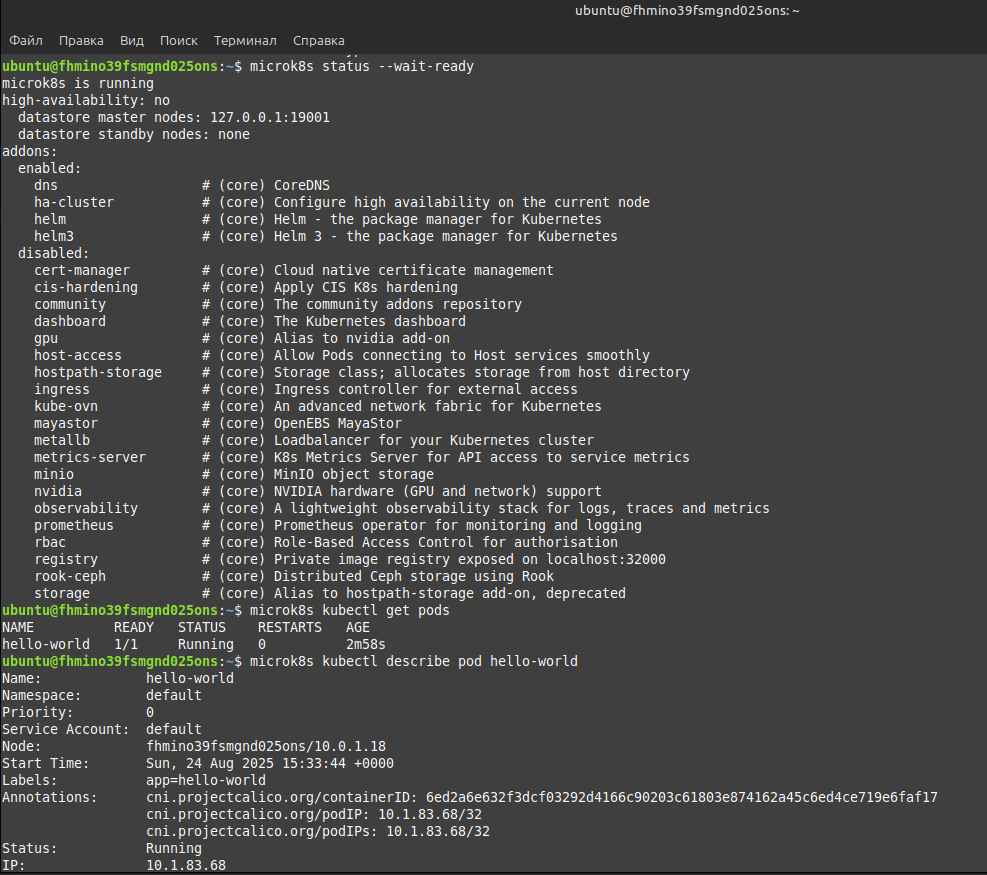
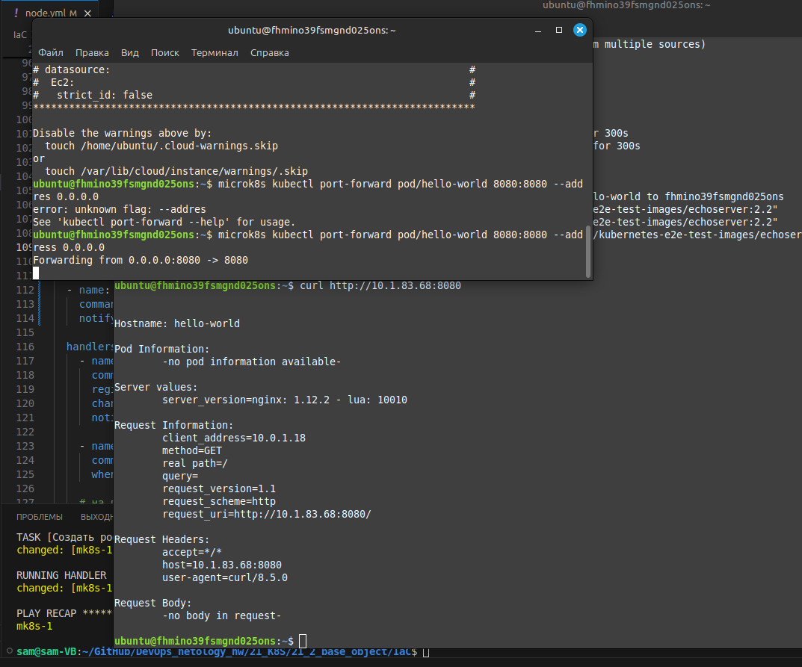
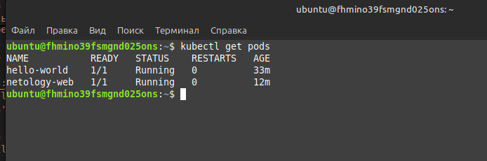
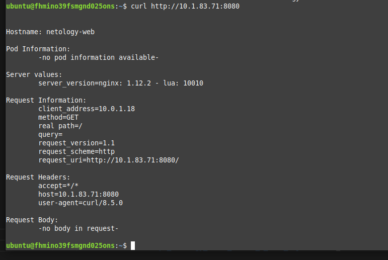

# Домашнее задание к занятию «Базовые объекты K8S» - Липовецкий Александр  
  
## Задание 1  
  
* Создать манифест (yaml-конфигурацию) Pod.  
* Использовать image - gcr.io/kubernetes-e2e-test-images/echoserver:2.2.  
* Подключиться локально к Pod с помощью kubectl port-forward и вывести значение (curl или в браузере).   
  
## Ответ на задание 1  
    
Развернута и настроена инфраструктура при помощи terraform и ansible, в том числе подняты поды и сервис.  
Для удобства использования написан скрипт **mk8s** для запуска и удаления проекта.  
Запуск производиться из директории ./IaC .
  
```bash  
# команда запуска  
./mk8s start  
# команда удаления  
./mk8s down  
```   
Ссылка на манифест hello-world  
[link1](./IaC/playbook/files/hello.yaml)  
  
Скриншот вывода значения curl (так как удаленная машина на YC)  
  
  
  
  
  
## Задание 2   
  
* Создать Pod с именем netology-web.  
* Использовать image — gcr.io/kubernetes-e2e-test-images/echoserver:2.2.  
* Создать Service с именем netology-svc и подключить к netology-web.  
* Подключиться локально к Service с помощью kubectl port-forward и вывести значение (curl или в браузере).  
  
## Ответ на задание 2  
  
Ссылка на манифест netology-web   
[link1](./IaC/playbook/files/netology_web.yaml)   
  
Ссылка на манифест netology-svc 
[link1](./IaC/playbook/files/service.yaml)  
  
  
  
  
  