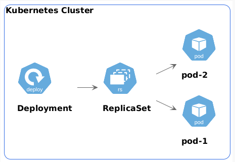
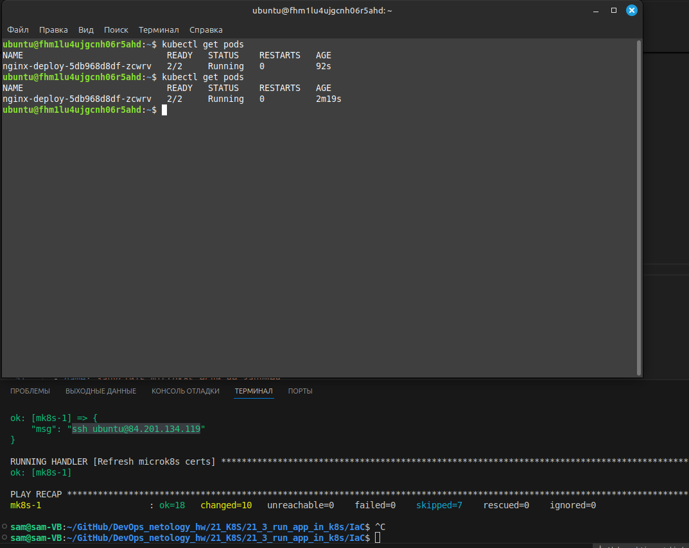
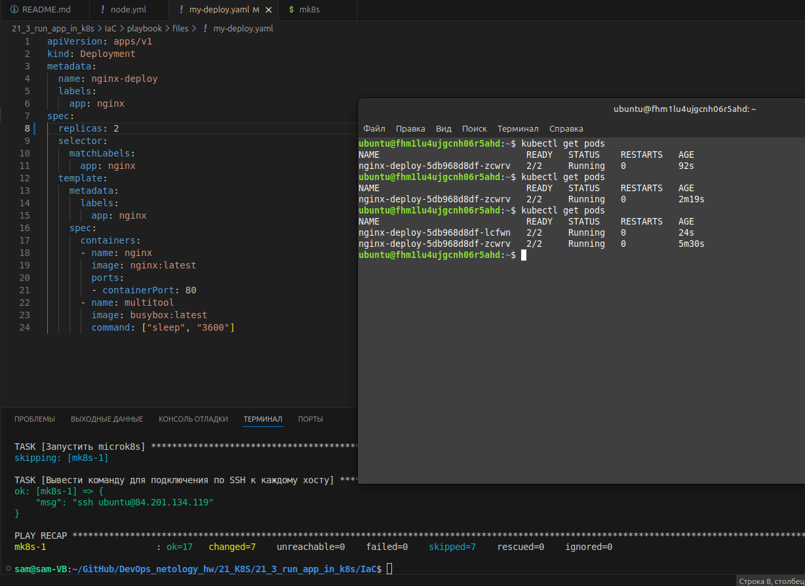
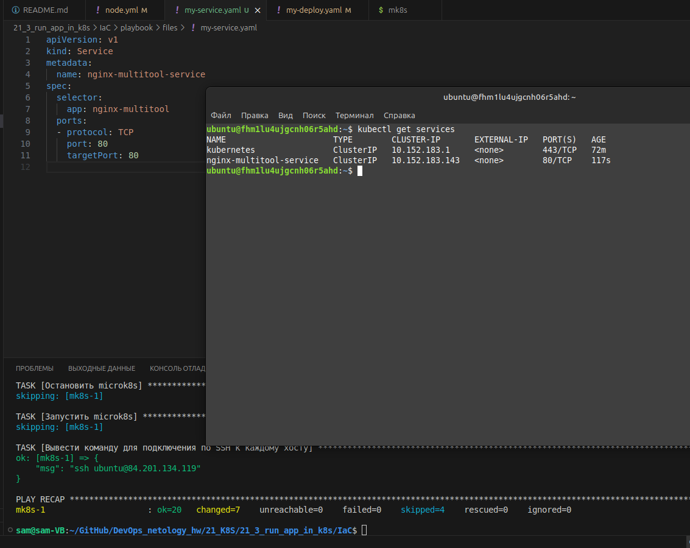
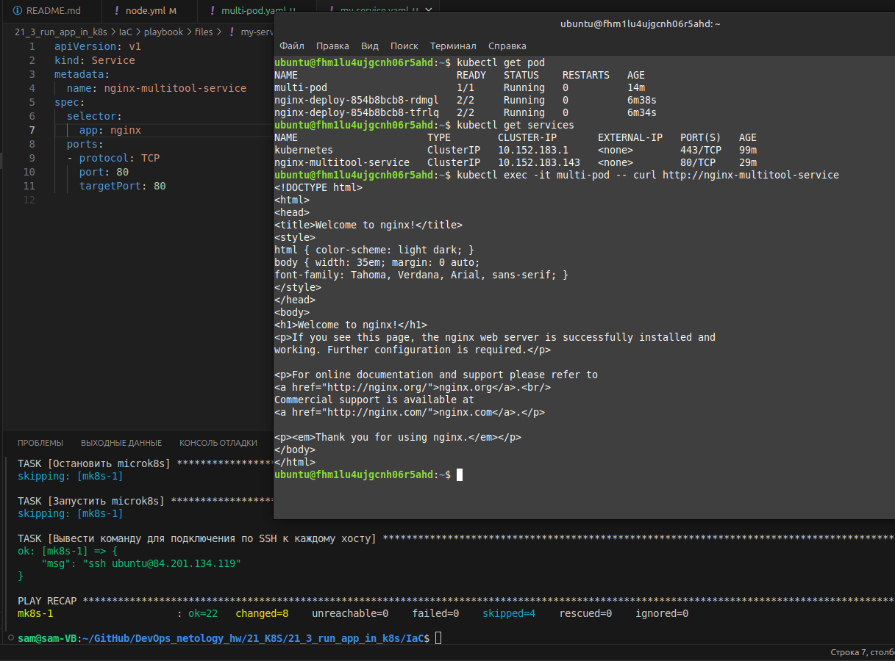
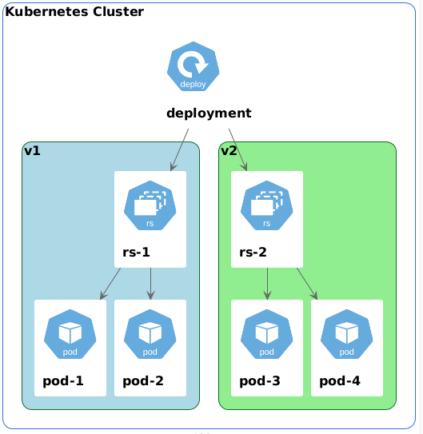
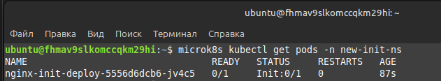
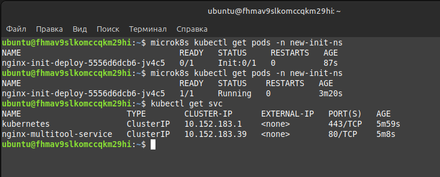

# Домашнее задание к занятию «Запуск приложений в K8S» - Липовецкий Александр  
  
## Задание 1. Создать Deployment и обеспечить доступ к репликам приложения из другого Pod  
  
* Создать Deployment приложения, состоящего из двух контейнеров — nginx и multitool. Решить возникшую ошибку.
* После запуска увеличить количество реплик работающего приложения до 2.
* Продемонстрировать количество подов до и после масштабирования.
* Создать Service, который обеспечит доступ до реплик приложений из п.1.
* Создать отдельный Pod с приложением multitool и убедиться с помощью curl, что из пода есть доступ до приложений из п.1.  
    
Схема кластера.  
  
  

## Ответ на задание 1  
     
Развернута и настроена инфраструктура при помощи terraform и ansible, в том числе подняты поды и сервис.   
Для удобства использования написан скрипт **mk8s** для запуска и удаления проекта.   
Запуск производиться из директории ./IaC .  
  
```bash  
# команда запуска  
./mk8s start  
# команда удаления  
./mk8s down  
```   
Ссылка на манифест [my-deploy](./IaC/playbook/files/my-deploy.yaml)  
  
Скриншот вывода статуса Deployment приложения.  
  
  
  
Скриншот вывода статуса Deployment приложения после увеличения количества реплик.  
  
  
  
Ссылка на манифест [my-service](./IaC/playbook/files/my-service.yaml)  
  
Скриншот вывода наличия Service.  
  
  
  
Ссылка на манифест [multi-pod](./IaC/playbook/files/multi-pod.yaml)  
  
Скриншот вывода результата curl.  
   
  
  
## Задание 2. Создать Deployment и обеспечить старт основного контейнера при выполнении условий   
   
* Создать Deployment приложения nginx и обеспечить старт контейнера только после того, как будет запущен сервис этого приложения.  
* Убедиться, что nginx не стартует. В качестве Init-контейнера взять busybox.  
* Создать и запустить Service. Убедиться, что Init запустился.  
* Продемонстрировать состояние пода до и после запуска сервиса. 
  
Схема кластера.  
  
  

## Ответ на задание 2  
  
Ссылка на манифест [nginx-init](./IaC/playbook/files/nginx-init.yaml)  
  
Скриншот вывода статуса Deployment приложения.  
  
  
  
Ссылка на манифест [nginx-init-service](./IaC/playbook/files/nginx-init-service.yaml)  
  
Скриншот вывода наличия Service и старта приложения.  
  
  
  