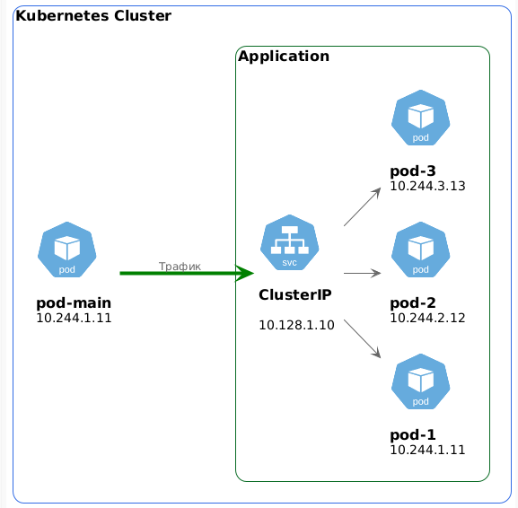
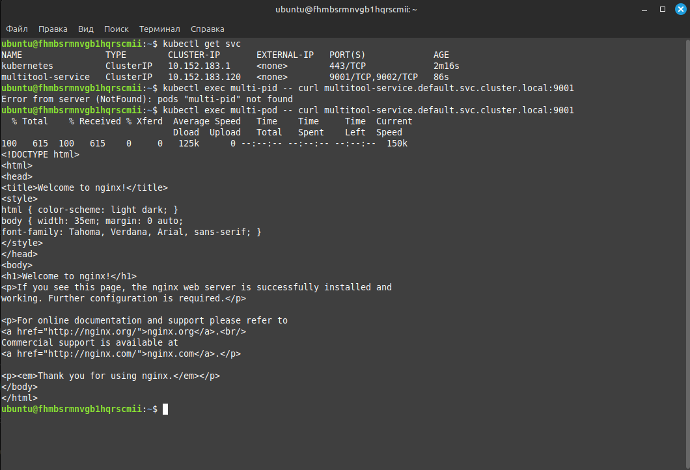
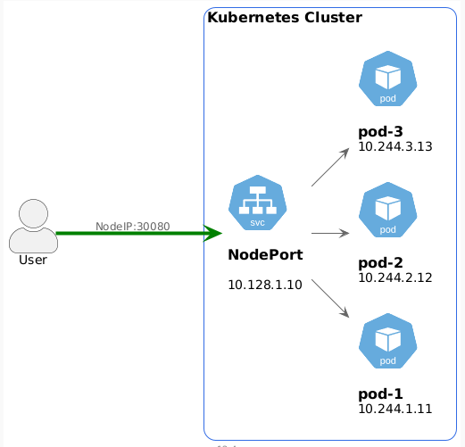
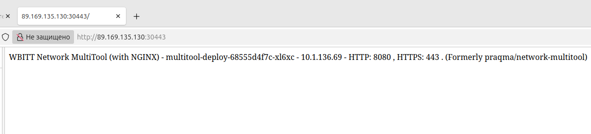

# Домашнее задание к занятию «Сетевое взаимодействие в K8S. Часть 1» - Липовецкий Александр  
  
## Задание 1. Создать Deployment и обеспечить доступ к контейнерам приложения по разным портам из другого Pod внутри кластера  
  
* Создать Deployment приложения, состоящего из двух контейнеров (nginx и multitool), с количеством реплик 3 шт.
* Создать Service, который обеспечит доступ внутри кластера до контейнеров приложения из п.1 по порту 9001 — nginx 80, по 9002 — multitool 8080.
* Создать отдельный Pod с приложением multitool и убедиться с помощью curl, что из пода есть доступ до приложения из п.1 по разным портам в разные контейнеры.
* Продемонстрировать доступ с помощью curl по доменному имени сервиса.
* Предоставить манифесты Deployment и Service в решении, а также скриншоты или вывод команды п.4. 
    
Схема кластера.  
  
  

## Ответ на задание 1  
     
Развернута и настроена инфраструктура при помощи terraform и ansible, в том числе подняты поды и сервис.   
Для удобства использования написан скрипт **mk8s** для запуска и удаления проекта.   
Запуск производиться из директории ./IaC .  
  
```bash  
# команда запуска  
./mk8s start  
# команда удаления  
./mk8s down  
```   
Ссылка на манифест [my-deploy](./IaC/playbook/files/my-deploy.yaml)  
  
Ссылка на манифест [my-service](./IaC/playbook/files/my-service.yaml)  
  
Ссылка на манифест [multi-pod](./IaC/playbook/files/multi-pod.yaml)  
  
Скриншот вывода результата curl.  
   
  
  
## Задание 2. Создать Service и обеспечить доступ к приложениям снаружи кластера  
   
* Создать отдельный Service приложения из Задания 1 с возможностью доступа снаружи кластера к nginx, используя тип NodePort.  
* Продемонстрировать доступ с помощью браузера или curl с локального компьютера.  
* Предоставить манифест и Service в решении, а также скриншоты или вывод команды п.2.  
  
Схема кластера.  
  
  
  
## Ответ на задание 2  
  
Ссылка на манифест [nodeport-service](./IaC/playbook/files/nodeport-service.yaml)  
  
Скриншот вывода запроса в браузере на nginx.  
  
  
  
Скриншот вывода запроса в браузере на multitool.  
  
  
  