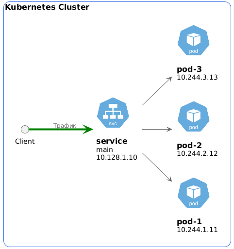
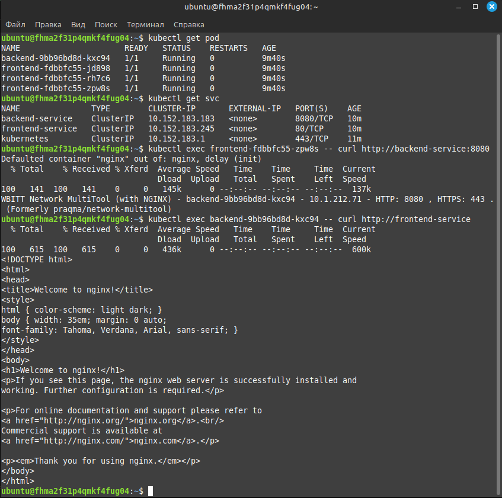
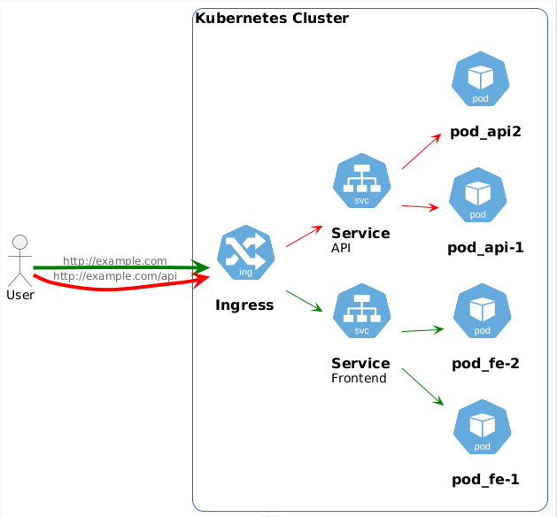
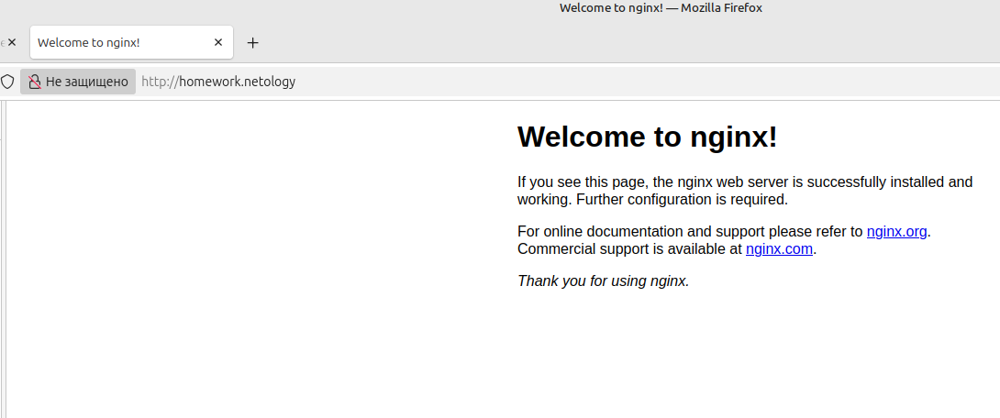
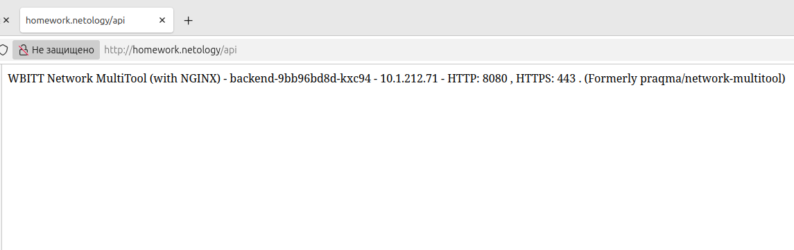

# Домашнее задание к занятию «Сетевое взаимодействие в K8S. Часть 2» - Липовецкий Александр  
  
## Задание 1. Создать Deployment приложений backend и frontend 
  
* Создать Deployment приложения frontend из образа nginx с количеством реплик 3 шт.  
* Создать Deployment приложения backend из образа multitool.  
* Добавить Service, которые обеспечат доступ к обоим приложениям внутри кластера.  
* Продемонстрировать, что приложения видят друг друга с помощью Service.  
* Предоставить манифесты Deployment и Service в решении, а также скриншоты или вывод команды п.4.  
    
Схема кластера.  
  
  

## Ответ на задание 1  
     
Развернута и настроена инфраструктура при помощи terraform и ansible, в том числе подняты поды и сервис.   
Для удобства использования написан скрипт **mk8s** для запуска и удаления проекта.   
Запуск производиться из директории ./IaC .  
  
```bash  
# команда запуска  
./mk8s start  
# команда удаления  
./mk8s down  
```   
Ссылка на манифест [my-deploy-front](./IaC/playbook/files/my-deploy-front.yaml)  

Ссылка на манифест [my-deploy-back](./IaC/playbook/files/my-deploy-back.yaml)  
  
Ссылка на манифест [my-service](./IaC/playbook/files/my-service.yaml)  
  
Скриншот вывода результата curl.  
   
  
  
## Задание 2. Создать Ingress и обеспечить доступ к приложениям снаружи кластера  
   
* Включить Ingress-controller в MicroK8S.  
* Создать Ingress, обеспечивающий доступ снаружи по IP-адресу кластера MicroK8S так, чтобы при запросе только по адресу открывался frontend а при добавлении /api - backend.  
* Продемонстрировать доступ с помощью браузера или curl с локального компьютера.  
* Предоставить манифесты и скриншоты или вывод команды п.2.  
  
Схема кластера.  
  
  
  
## Ответ на задание 2  
  
Ссылка на манифест [ingress](./IaC/playbook/files/ingress.yaml)  
  
Скриншот вывода запроса в браузере на frontend.  
  
  
  
Скриншот вывода запроса в браузере на backend.  
  
  
  