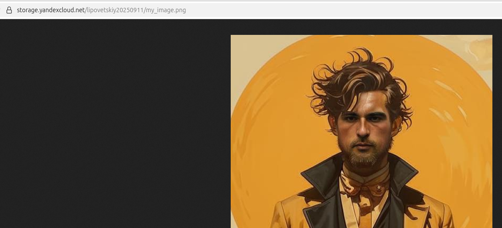
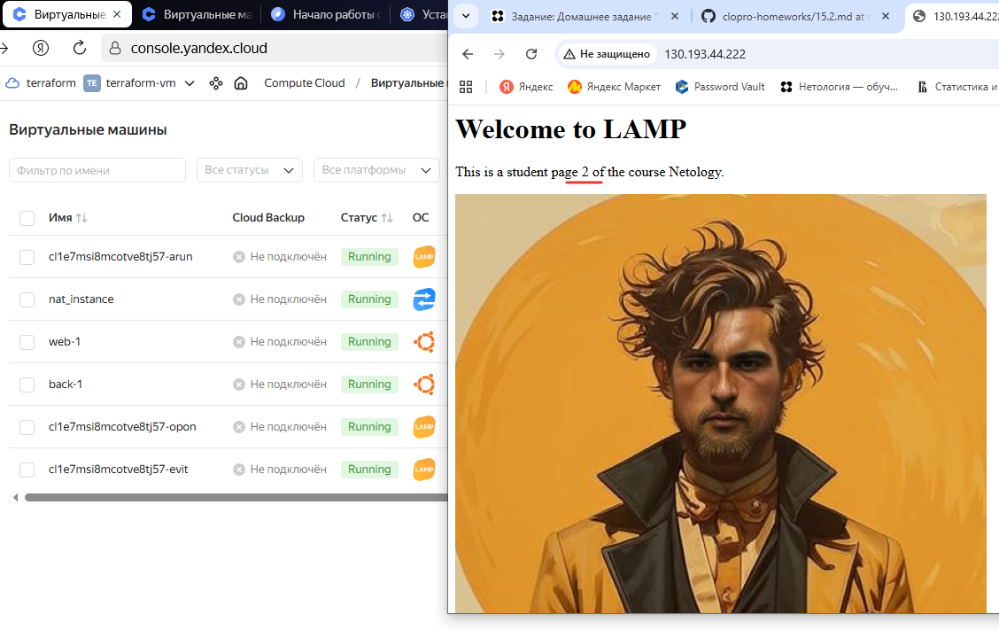
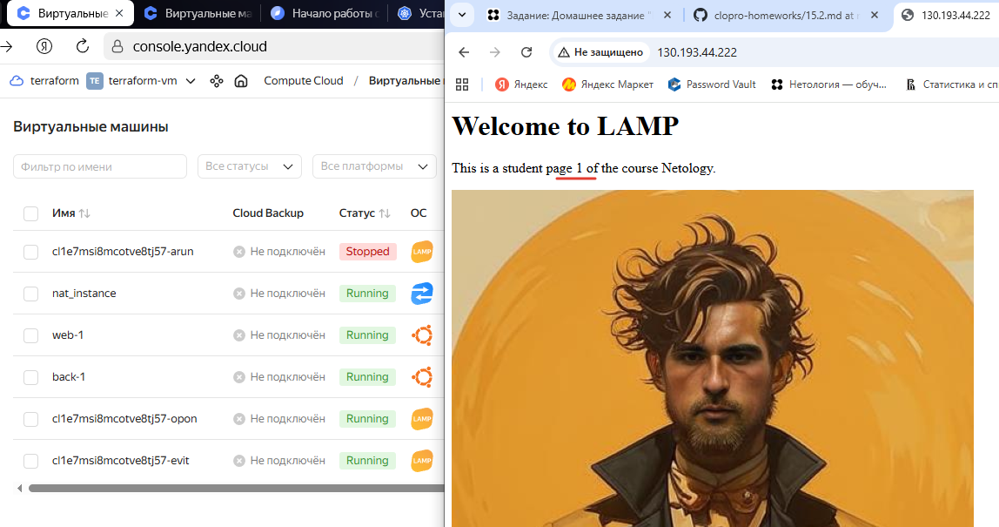

# Домашнее задание к занятию «Вычислительные мощности. Балансировщики нагрузки» - Липовецкий Александр  
  
## Задание  
  
1. Создать бакет Object Storage и разместить в нём файл с картинкой:  
* Создать бакет в Object Storage с произвольным именем (например, имя_студента_дата).  
* Положить в бакет файл с картинкой.  
* Сделать файл доступным из интернета.  
  
2. Создать группу ВМ в public подсети фиксированного размера с шаблоном LAMP и веб-страницей, содержащей ссылку на картинку из бакета:  
* Создать Instance Group с тремя ВМ и шаблоном LAMP. Для LAMP рекомендуется использовать image_id = fd827b91d99psvq5fjit.  
* Для создания стартовой веб-страницы рекомендуется использовать раздел user_data в meta_data.  
* Разместить в стартовой веб-странице шаблонной ВМ ссылку на картинку из бакета.  
* Настроить проверку состояния ВМ.  
   
3. Подключить группу к сетевому балансировщику:  
* Создать сетевой балансировщик.  
* Проверить работоспособность, удалив одну или несколько ВМ.  
  
## Ответ на задание   
     
Ссылка на Terraform [src](./src/)  
  
Скриншоты выполнения задания.    
  
  
  
  
  
Для наглядности влез на машины и руками поправил страницу, дописав ее номер на каждой машине в группе.  
  
  
  
Видно, что после отключения одной машины номер на странице изменился.  
  
   
  