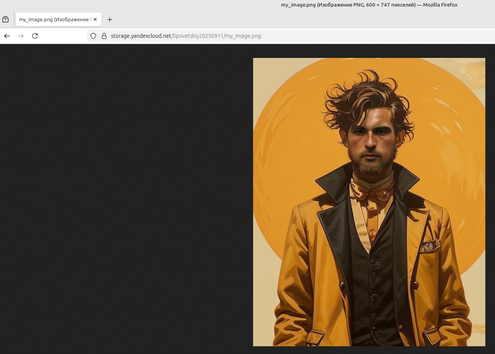
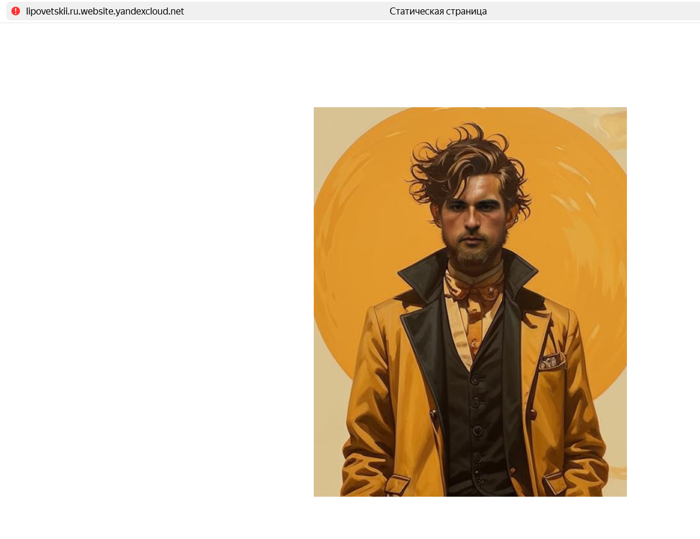
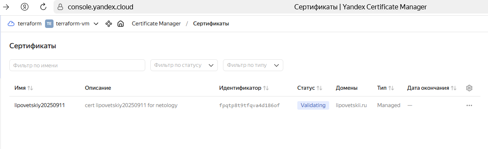
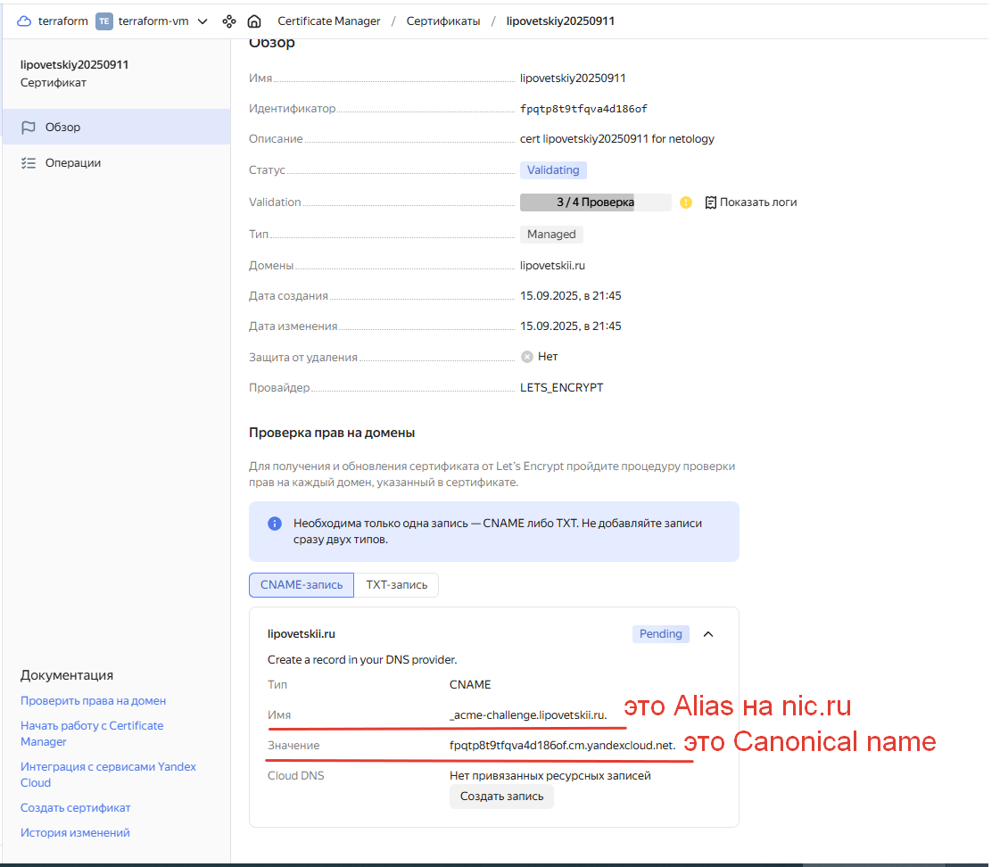
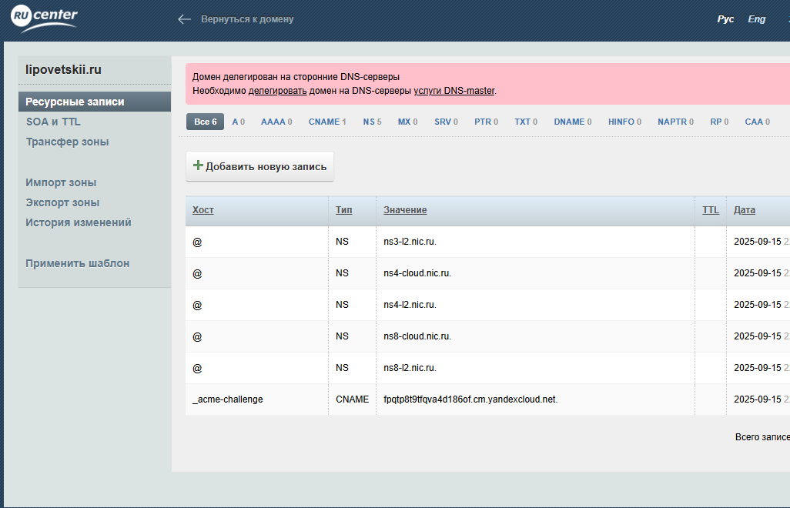
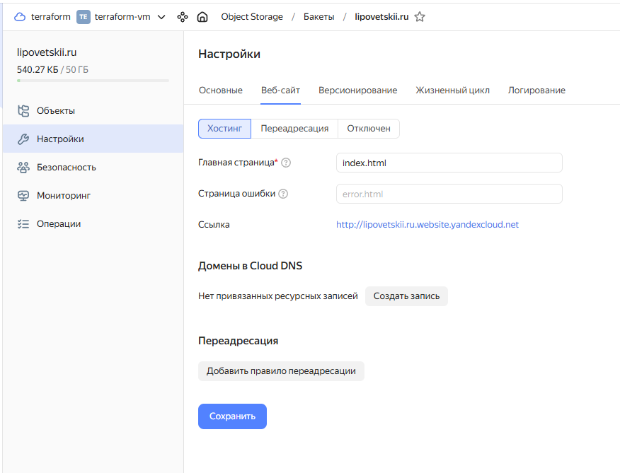
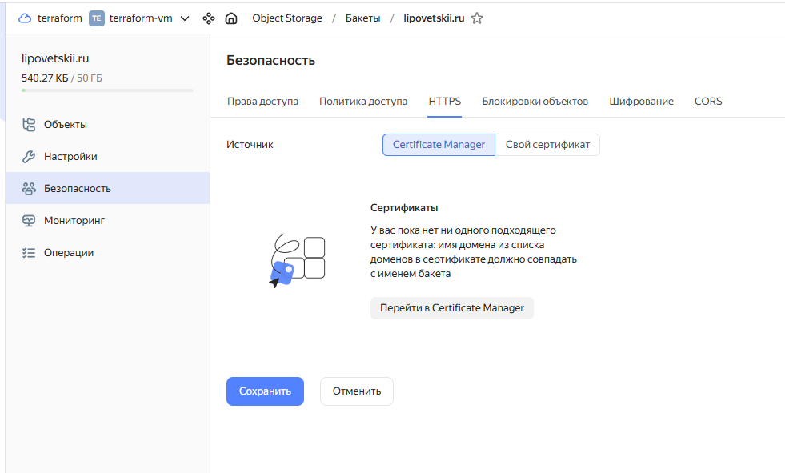

# Домашнее задание к занятию «Безопасность в облачных провайдерах» - Липовецкий Александр  
  
## Задание  
  
1. С помощью ключа в KMS необходимо зашифровать содержимое бакета:  
* создать ключ в KMS;  
* с помощью ключа зашифровать содержимое бакета, созданного ранее.  
  
2. (Выполняется не в Terraform)* Создать статический сайт в Object Storage c собственным публичным адресом и сделать доступным по HTTPS:  
* создать сертификат;  
* создать статическую страницу в Object Storage и применить сертификат HTTPS;  
* в качестве результата предоставить скриншот на страницу с сертификатом в заголовке (замочек).  
   
3. Подключить группу к сетевому балансировщику:  
* Создать сетевой балансировщик.  
* Проверить работоспособность, удалив одну или несколько ВМ.  
  
## Ответ на задание   
     
Ссылка на Terraform [src](./src/)  
  
Скриншоты выполнения задания.    
  
Создал ключ и зашифровал содержимое бакета.  
  
  
  
Далее удалил проект и в консоли создал статический сайт в Object Storage c собственным публичным адресом.    
  
  
    
Далее занялся выпуском сертификата для домена lipovetskii.ru и как оказалось, он выпускается не быстро.  
  
  
  
Для проверки в nic.ru создал CNAME.  
  
   
    
  
  
Осталось дождаться выпуска сертификата и добавить его.  
  
  
  
  
  
Надеюсь этого достаточно для завершения задания.  
    